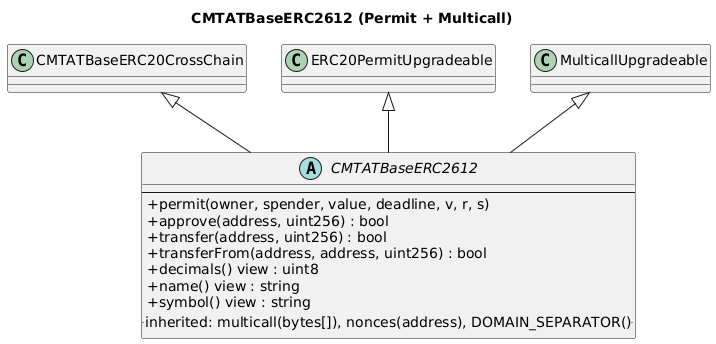

# ERC-2612 Permit + ERC-6357 Multicall Module

This document describes `CMTATBaseERC2612`, which extends CMTAT with ERC-2612 gasless approvals and ERC-6357 multicall batching.

[TOC]

## Schema



## Rationale

**ERC-2612 (Permit)** — Allows token holders to authorize allowances via an off-chain EIP-712 signature rather than an on-chain `approve` transaction. This eliminates the need for a separate approval step, reducing gas costs and improving UX for relayer flows.

**ERC-6357 (Multicall)** — Allows multiple calls to the same contract to be batched into a single transaction via `delegatecall`. This saves gas when a user needs to perform several operations atomically (e.g., set terms and freeze in one tx).

## Contract

`contracts/modules/6_CMTATBaseERC2612.sol`

Inherits from:
- `CMTATBaseERC20CrossChain` — full CMTAT feature set including CCIP and ERC-7802
- `ERC20PermitUpgradeable` (OpenZeppelin) — ERC-2612 implementation
- `MulticallUpgradeable` (OpenZeppelin) — ERC-6357 implementation

## The EIP-712 domain name is fixed at deployment

The EIP-712 domain used by `permit` is built at initialization from the token name passed to the constructor/initializer. It is stored by OpenZeppelin's `EIP712Upgradeable`, whose documentation states that these parameters *"cannot be changed except through a smart contract upgrade"*.

`TokenAttributeModule.setName(string)` changes what `name()` returns, but it does **not** touch that stored domain name. After a rename:

| Call | Value |
|---|---|
| `name()` | the **new** name |
| `eip712Domain().name` (ERC-5267) | the **original** name |
| `DOMAIN_SEPARATOR()` | unchanged |

**`permit` keeps working.** The domain separator stays stable and valid, so previously issued permits remain redeemable and new ones can still be produced. What changes is only how a signer must discover the domain:

- ✅ build the EIP-712 domain from **`eip712Domain()`** (ERC-5267), or use `DOMAIN_SEPARATOR()` directly — this is the standard, rename-proof way, and is what modern wallets do;
- ❌ do **not** derive it from `name()`. A signature produced with the post-rename `name()` is rejected on-chain with `ERC2612InvalidSigner`.

Issuers who intend to use `setName` on a Permit deployment should confirm that their integrators read `eip712Domain()`, since an integration hard-coded to `name()` will start producing invalid signatures at the moment of the rename — silently, until a `permit` call reverts.

> Reported as NM-21 by [Nethermind AuditAgent](https://auditagent.nethermind.io/) on CMTAT v3.3.0-rc2. The report described this as a permanent denial of service for `permit`; verification showed that is not the case — `permit` continues to work through `eip712Domain()`. See the [maintainer feedback](../../../security/tools/nethermind-audit-agent/v3.3.0-rc2/audit_agent_report_v3.3.0-rc2-feedback.md).

## Deployment Variants

| Contract | Type |
|---|---|
| `contracts/deployment/permit/CMTATStandalonePermit.sol` | Immutable (no proxy) |
| `contracts/deployment/permit/CMTATUpgradeablePermit.sol` | Transparent / Beacon proxy |

## API for Ethereum

### Functions

#### `permit(address,address,uint256,uint256,uint8,bytes32,bytes32)`

```solidity
function permit(
    address owner,
    address spender,
    uint256 value,
    uint256 deadline,
    uint8 v,
    bytes32 r,
    bytes32 s
) public virtual override(ERC20PermitUpgradeable)
```

Sets `allowance[owner][spender]` to `value` using a signed EIP-712 message, without requiring an on-chain transaction from `owner`.

CMTAT adds the following checks on top of the standard OpenZeppelin implementation:

- Contract must not be paused.
- `owner` must not be frozen (allowance validation via `ValidationModuleAllowance`).
- `spender` must not be frozen.

**Parameters**

| Name       | Type      | Description                              |
|------------|-----------|------------------------------------------|
| `owner`    | `address` | Account granting the allowance.          |
| `spender`  | `address` | Account receiving the allowance.         |
| `value`    | `uint256` | Allowance amount.                        |
| `deadline` | `uint256` | Expiry timestamp for the signature.      |
| `v`        | `uint8`   | ECDSA recovery byte.                     |
| `r`        | `bytes32` | ECDSA signature half.                    |
| `s`        | `bytes32` | ECDSA signature half.                    |

**Requirements**

- `deadline >= block.timestamp`
- Signature is valid for the given `owner`
- Contract is not paused
- `owner` and `spender` are not frozen

---

#### `multicall(bytes[])`

```solidity
function multicall(bytes[] calldata data) external returns (bytes[] memory results)
```

Executes multiple calls to this contract in a single transaction using `delegatecall`. Reverts atomically if any sub-call fails.

Provided by OpenZeppelin `MulticallUpgradeable`. See [ERC-6357](../../../ERCSpecification/erc-6357-multicall.md).

**Parameters**

| Name   | Type      | Description                              |
|--------|-----------|------------------------------------------|
| `data` | `bytes[]` | Array of ABI-encoded function call data. |

**Returns**

| Name      | Type      | Description                         |
|-----------|-----------|-------------------------------------|
| `results` | `bytes[]` | ABI-encoded return values per call. |

---

#### `nonces(address)`

```solidity
function nonces(address owner) external view returns (uint256)
```

Returns the current permit nonce for `owner`. Incremented on each successful `permit` call.

---

#### `DOMAIN_SEPARATOR()`

```solidity
function DOMAIN_SEPARATOR() external view returns (bytes32)
```

Returns the EIP-712 domain separator used for permit signature verification.

## Security Considerations

- The `permit` function validates both pause state and freeze state before delegating to OpenZeppelin's implementation, consistent with how CMTAT validates standard `approve`.
- `multicall` uses `delegatecall` — all sub-calls share `msg.sender` and contract storage. Do not use with ETH values unless the contract is designed for it.
- Permit signatures are replayable across chains if the chain ID changes (e.g., after a fork). OpenZeppelin's implementation includes the chain ID in `DOMAIN_SEPARATOR`, mitigating this.
