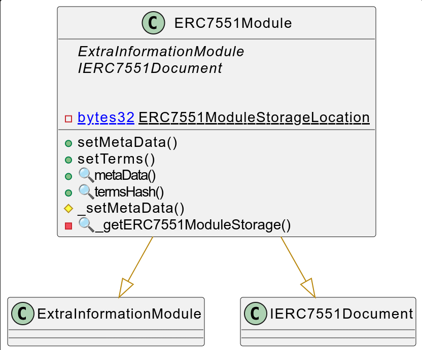
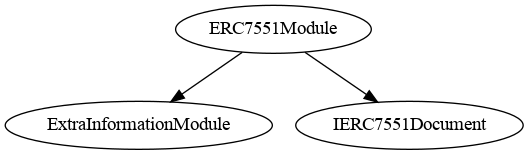
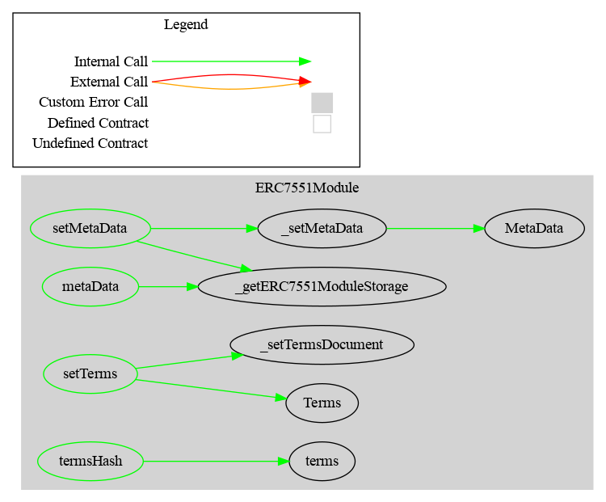

#  ERC7551 Module (eWpG)

This document covers the ERC-7551 modules for the CMTA Token specification. Two contracts implement ERC-7551 support:

| Contract | Purpose |
|---|---|
| `ERC7551Module` | Document and metadata functions (`metaData`, `setMetaData`, `terms`, `setTerms`, `termsHash`) |
| `ERC20EnforcementERC7551Module` | Enforcement bytes overloads (`forcedTransfer`, `freezePartialTokens`, `unfreezePartialTokens`) and `getActiveBalanceOf` |

`ERC7551Module` is composed in `CMTATBaseERC7551` (`contracts/modules/7_CMTATBaseERC7551.sol`), which is the base for the ERC-7551 deployment variants (`CMTATStandaloneERC7551`, `CMTATUpgradeableERC7551`).

`ERC20EnforcementERC7551Module` is also composed in `CMTATBaseERC7551Enforcement` (`contracts/modules/6_CMTATBaseERC7551Enforcement.sol`), which is used by the Standard deployment variants (`CMTATStandardStandalone`, `CMTATStandardUpgradeable`).

It is also composed in `CMTATBaseAllowlist` (`contracts/modules/2_CMTATBaseAllowlist.sol`), so Allowlist deployment variants expose the same ERC-7551 enforcement functions.

[TOC]

## Schema



### Inheritance



### Graph




## API for Ethereum

This section describes the Ethereum API of the ERC7551 Module. 

See also [IERC7551Document](../../../../contracts/interfaces/tokenization/draft-IERC7551.sol)

### Events

#### `MetaData`

```solidity
event MetaData(string newMetaData)
```

Emitted when the metadata string is updated.

##### Parameters

| Name          | Type     | Description                                    |
| ------------- | -------- | ---------------------------------------------- |
| `newMetaData` | `string` | The new metadata value (e.g. URL or document). |

### Functions

#### `termsHash()`

```solidity
function termsHash() external view returns (bytes32 hash_)
```

```solidity
function termsHash() 
public view virtual override(IERC7551Document) 
returns (bytes32 hash_)
```

Returns the hash of the "Terms" document.

##### Returns

| Name  | Type      | Description                     |
| ----- | --------- | ------------------------------- |
| hash_ | `bytes32` | The hash of the terms document. |


------

#### `setTerms(bytes32,string)`

```
function setTerms(bytes32 _hash, string _uri) external
```

```solidity
function setTerms(bytes32 hash, string calldata uri) 
public virtual override(IERC7551Document) 
onlyRole(EXTRA_INFORMATION_ROLE)
```

Sets the hash and URI for the "Terms" document.

##### Parameters

| Name  | Type      | Description                       |
| ----- | --------- | --------------------------------- |
| _hash | `bytes32` | The new hash of the document.     |
| _uri  | `string`  | The URI associated with the hash. |

**Requirements:**

- Only authorized users (*EXTRA_INFORMATION_ROLE*) are allowed to call this function.

------

#### `metaData`

```solidity
function metaData() external view returns (string metadata_)
```

```solidity
function metaData() 
public view virtual override(IERC7551Document) 
returns (string memory metadata_) 
```

Returns the metadata string (commonly a URL).

##### Returns

| Name      | Type     | Description          |
| --------- | -------- | -------------------- |
| metadata_ | `string` | The metadata string. |


------

#### `setMetaData(string)`

```solidity
function setMetaData(string metaData_) external
```

```solidity
function setMetaData(string calldata metadata_) 
public virtual override(IERC7551Document) 
onlyRole(EXTRA_INFORMATION_ROLE) 
```

Sets a new metadata string (commonly a URL).

##### Parameters

| Name      | Type     | Description             |
| --------- | -------- | ----------------------- |
| metaData_ | `string` | The new metadata value. |

**Requirements:**

- Only authorized users (*EXTRA_INFORMATION_ROLE*) are allowed to call this function.

---

## ERC20EnforcementERC7551Module

`contracts/modules/wrapper/options/ERC20EnforcementERC7551Module.sol`

Extends `ERC20EnforcementModule` with the ERC-7551 enforcement interface (`IERC7551ERC20Enforcement`). Adds `bytes data` overloads for enforcement functions (for audit trails and metadata), plus the `getActiveBalanceOf` view.

See also: [ERC20 Enforcement Module](../../extensions/ERC20Enforcement/erc20enforcement.md)

### Functions

#### `getActiveBalanceOf(address)`

```solidity
function getActiveBalanceOf(address account) public view returns (uint256 activeBalance_)
```

Returns the number of tokens available for transfer (total balance minus frozen tokens).

| Name      | Type      | Description |
|-----------|-----------|-------------|
| `account` | `address` | The address to query. |

---

#### `getFrozenTokens(address)`

```solidity
function getFrozenTokens(address account) public view returns (uint256 frozenBalance_)
```

Returns frozen token count. Overrides both `ERC20EnforcementModule` and `IERC7551ERC20Enforcement`.

---

#### `forcedTransfer(address,address,uint256,bytes)`

```solidity
function forcedTransfer(address from, address to, uint256 value, bytes calldata data)
    public virtual onlyForcedTransferManager returns (bool)
```

Forced transfer with additional `data` payload for audit or compliance metadata. Unfreezes tokens from `from` as needed.
Emits ERC-7551 event `ForcedTransfer(operator, from, to, value, data)`.
If tokens were unfrozen to fulfill the transfer, also emits `TokensUnfrozen(from, amount, data)`.

**Requirements:** caller must have `DEFAULT_ADMIN_ROLE`.

---

#### `freezePartialTokens(address,uint256,bytes)`

```solidity
function freezePartialTokens(address account, uint256 value, bytes calldata data)
    public virtual onlyERC20Enforcer
```

Freezes `value` tokens on `account`, with a `data` payload attached to the freeze event.

**Requirements:** caller must have `ERC20ENFORCER_ROLE`.

---

#### `unfreezePartialTokens(address,uint256,bytes)`

```solidity
function unfreezePartialTokens(address account, uint256 value, bytes calldata data)
    public virtual onlyERC20Enforcer
```

Unfreezes `value` tokens on `account`, with a `data` payload attached to the unfreeze event.

**Requirements:** caller must have `ERC20ENFORCER_ROLE`.
