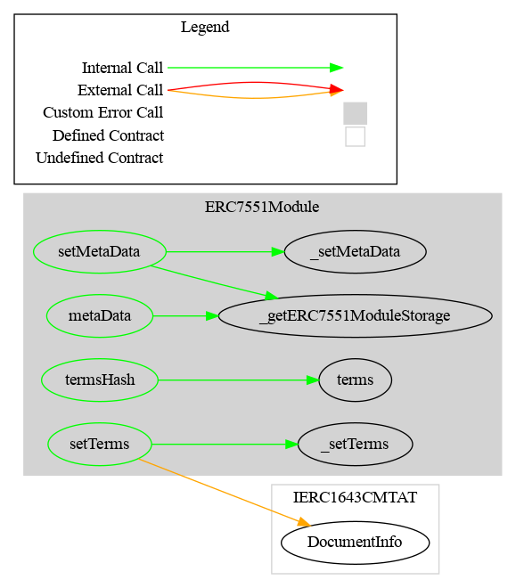

#  ERC7551 Module (eWpG)

This document defines the ERC7551 Module for the CMTA Token specification. The goal of this module is to implement specific function required by ERC-7551 authors.

[TOC]

## Schema


### Inheritance


### Graph




## API for Ethereum

This section describes the Ethereum API of the ERC7551 Module. 

See also [IERC7551Document](../../../../contracts/interfaces/tokenization/draft-IERC7551.sol)

### Events

#### `MetaData`

```solidity
event MetaData(string newMetaData)
```

Emitted when the metadata string is updated.

##### Parameters

| Name          | Type     | Description                                    |
| ------------- | -------- | ---------------------------------------------- |
| `newMetaData` | `string` | The new metadata value (e.g. URL or document). |

### Functions

#### `termsHash()`

```solidity
function termsHash() external view returns (bytes32 hash_)
```

```solidity
function termsHash() 
public view virtual override(IERC7551Document) 
returns (bytes32 hash_)
```

Returns the hash of the "Terms" document.

##### Returns

| Name  | Type      | Description                     |
| ----- | --------- | ------------------------------- |
| hash_ | `bytes32` | The hash of the terms document. |


------

#### `setTerms(bytes32,string)`

```
function setTerms(bytes32 _hash, string _uri) external
```

```solidity
function setTerms(bytes32 hash, string calldata uri) 
public virtual override(IERC7551Document) 
onlyRole(EXTRA_INFORMATION_ROLE)
```

Sets the hash and URI for the "Terms" document.

##### Parameters

| Name  | Type      | Description                       |
| ----- | --------- | --------------------------------- |
| _hash | `bytes32` | The new hash of the document.     |
| _uri  | `string`  | The URI associated with the hash. |

**Requirements:**

- Only authorized users (*EXTRA_INFORMATION_ROLE*) are allowed to call this function.

------

#### `metaData`

```solidity
function metaData() external view returns (string metadata_)
```

```solidity
function metaData() 
public view virtual override(IERC7551Document) 
returns (string memory metadata_) 
```

Returns the metadata string (commonly a URL).

##### Returns

| Name      | Type     | Description          |
| --------- | -------- | -------------------- |
| metadata_ | `string` | The metadata string. |


------

#### `setMetaData(string)`

```solidity
function setMetaData(string metaData_) external
```

```solidity
function setMetaData(string calldata metadata_) 
public virtual override(IERC7551Document) 
onlyRole(EXTRA_INFORMATION_ROLE) 
```

Sets a new metadata string (commonly a URL).

##### Parameters

| Name      | Type     | Description             |
| --------- | -------- | ----------------------- |
| metaData_ | `string` | The new metadata value. |

**Requirements:**

- Only authorized users (*EXTRA_INFORMATION_ROLE*) are allowed to call this function.
