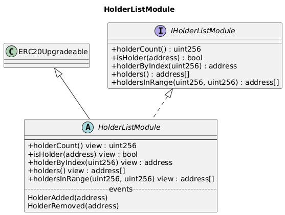
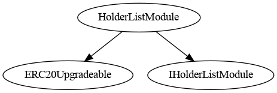
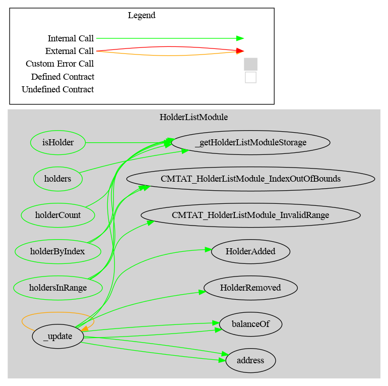

# HolderList Module

The `HolderListModule` maintains, on-chain, the set of addresses that currently hold a **non-zero balance**, with paginated reads. It is an optional module exposed on the `CMTATBaseHolderList` base and its dedicated deployment variants (`CMTATStandaloneHolderList` / `CMTATUpgradeableHolderList`), introduced in **v3.3.0**.

The holder set is a pure **view over `balanceOf`**: an address belongs to it **if and only if** its balance is non-zero. The set is updated inside the ERC-20 `_update` hook, **after** balances have been written, so every balance change is covered: `transfer`, `transferFrom`, `mint`, `burn`, forced transfer/burn, and cross-chain mint/burn. It is backed by an OpenZeppelin `EnumerableSet.AddressSet` in its own ERC-7201 storage slot.

See also the technical guide: [technical/holder-list.md](../../../technical/holder-list.md).

## Schema

### Inheritance

### Graph

## API for Ethereum

**All reads are unrestricted** (no role): the holder set is derivable from the transfer log anyway. `CMTATBaseHolderList.supportsInterface` returns `true` for `type(IHolderListModule).interfaceId`, so the capability is discoverable on-chain.

### Events

#### `HolderAdded(address indexed holder)`

Emitted when an address becomes a holder (its balance goes from zero to non-zero).

#### `HolderRemoved(address indexed holder)`

Emitted when an address stops being a holder (its balance drops to zero).

### Errors

#### `CMTAT_HolderListModule_IndexOutOfBounds(uint256 index, uint256 holderCount)`

Reverted when a requested index is greater than or equal to `holderCount()`.

#### `CMTAT_HolderListModule_InvalidRange(uint256 fromIndex, uint256 toIndex)`

Reverted when `fromIndex > toIndex` (this malformed-range check runs first).

### Functions

#### `holderCount() -> uint256`

Number of addresses currently holding a non-zero balance.

#### `isHolder(address account) -> bool`

`true` iff `account`'s balance is non-zero.

#### `holderByIndex(uint256 index) -> address`

Holder at `index`; reverts `CMTAT_HolderListModule_IndexOutOfBounds` if `index >= holderCount()`.

#### `holders() -> address[]`

The whole list in one call. **Unbounded** — this is an off-chain (`eth_call`) getter; on-chain callers, and any caller that cannot bound the holder count, MUST use `holdersInRange` with a bounded window.

#### `holdersInRange(uint256 fromIndex, uint256 toIndex) -> address[]`

The half-open window `[fromIndex, toIndex)` (length `toIndex - fromIndex`). Reverts `CMTAT_HolderListModule_InvalidRange` if `fromIndex > toIndex`, and `CMTAT_HolderListModule_IndexOutOfBounds` if `toIndex > holderCount()`; `fromIndex == toIndex` returns an empty array without reverting.

## Notes

- `address(0)` (the mint source and burn sink) is **never** a holder, and a **zero-value** transfer to a fresh address does **not** create one.
- **Windows are not a consistent snapshot** across blocks: the underlying `EnumerableSet` is unordered and a removal moves the last holder into the freed slot, so `holderByIndex` / `holdersInRange` results read across several blocks may miss a holder or return one twice. Read the whole set at a fixed block (`eth_call` at a block number) if a consistent view is required.
- For historical *balance-at-a-block* queries, use the [Snapshot Engine](../../extensions/snapshotEngine/Snapshot.md) instead — the holder list tracks *current* membership, not historical balances.
