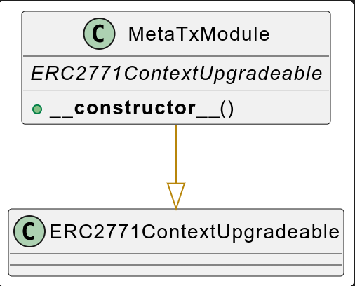

# MetaTx Module

This document defines the MetaTx Module for the CMTA Token specification. The goal of the MetaTx Module is to enable wallets to transfer tokens without having native tokens in their wallet.

[TOC]

## Rationale

> Support for transaction fee transfer, also known as "gasless transactions" in the Ethereum context.

## Schema

### Inheritance

### Graph

## API for Ethereum

This section describes the Ethereum API of the MetaTx Module. 

This modules uses ERC2771 implementation from OpenZeppelin: [https://docs.openzeppelin.com/contracts/5.x/api/metatx](https://docs.openzeppelin.com/contracts/5.x/api/metatx)

