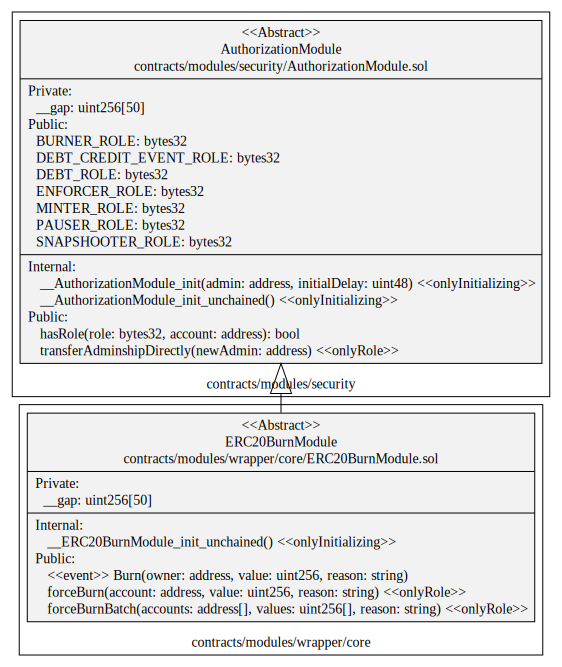

# ERC20Burn Module

This document defines the ERC20Burn Module for the CMTA Token specification.

[TOC]


## Rationale

> This function allows the issuer to destroy specific tokens that are recorded on a distributed ledger address. This function is meant to be used if the issuer cancels tokenized shares (e.g. if it reduces its share capital, if it has decided to have the shares in a different form (e.g. “simple” uncertificated securities within the meaning of Article 973c CO or paper certificates), or to comply with a court order requiring the cancellation of tokens pursuant to Article 973h CO).

## Schema

### Inheritance


### UML



### Graph


## Sūrya's Description Report

### Files Description Table


| File Name                                  | SHA-1 Hash                               |
| ------------------------------------------ | ---------------------------------------- |
| ./modules/wrapper/core/ERC20BurnModule.sol | 127c0419786d6b33f117b4f8dda6e15ef9a04e1e |


### Contracts Description Table


|      Contract       |               Type               |                 Bases                 |                |                  |
| :-----------------: | :------------------------------: | :-----------------------------------: | :------------: | :--------------: |
|          └          |        **Function Name**         |            **Visibility**             | **Mutability** |  **Modifiers**   |
|                     |                                  |                                       |                |                  |
| **ERC20BurnModule** |          Implementation          | ERC20Upgradeable, AuthorizationModule |                |                  |
|          └          |      __ERC20BurnModule_init      |              Internal 🔒               |       🛑        | onlyInitializing |
|          └          | __ERC20BurnModule_init_unchained |              Internal 🔒               |       🛑        | onlyInitializing |
|          └          |            forceBurn             |               Public ❗️                |       🛑        |     onlyRole     |
|          └          |          forceBurnBatch          |               Public ❗️                |       🛑        |     onlyRole     |


### Legend

| Symbol | Meaning                   |
| :----: | ------------------------- |
|   🛑    | Function can modify state |
|   💵    | Function is payable       |

## API for Ethereum

This section describes the Ethereum API of Burn Module.

### Functions

#### `forceBurn(address,uint256,string)`

##### Definition

```solidity
function forceBurn(address account,uint256 amount,string memory reason) 
public onlyRole(BURNER_ROLE)
```

##### Description

Destroys a `value` amount of tokens from `account`, by transferring it to address(0).

##### Requirements

Only authorized users (*BURNER_ROLE*) are allowed to call this function.

#### `forceBurnBatch(address[],uint256[],string)  `

##### Definition

```solidity
function forceBurnBatch(address[] calldata accounts,uint256[] calldata amounts,string memory reason) 
public onlyRole(BURNER_ROLE)
```

##### Description

For each account in `accounts`, destroys a `value` amount of tokens from `account`, by transferring it to address(0).

The burn `reason`is the same for all `accounts` which tokens are burnt.

##### Requirements

- `accounts` and `values` must have the same length

- The caller must have the `BURNER_ROLE`.

### Events

#### `Burn(address,uint,string)`

##### Definition

```solidity
event Burn(address indexed owner, uint256 amount, string reason)
```

##### Description

Emitted when the specified `value` amount of tokens owned by `owner`are destroyed with the given `reason`

​    
