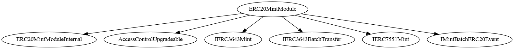
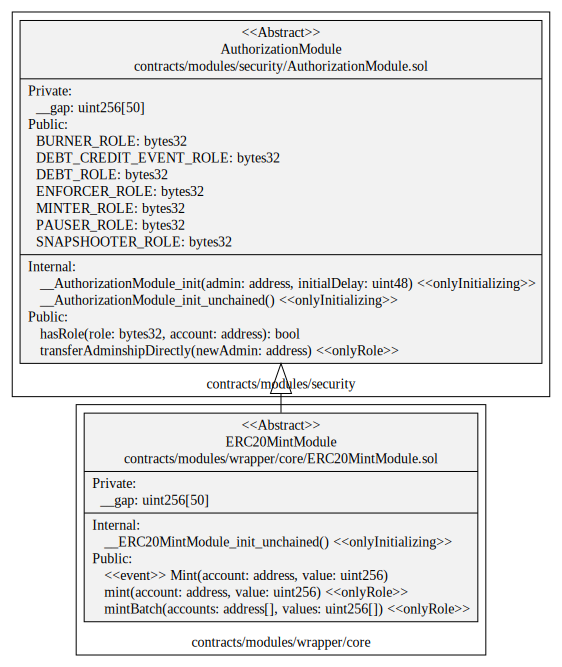
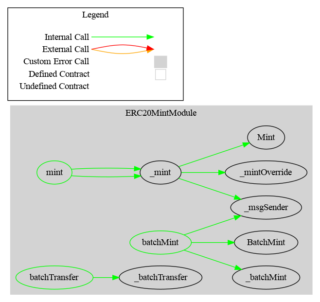

# ERC20Mint Module

This document defines ERC20Mint Module for the CMTA Token specification.

[TOC]


## Rationale

>  Traditional securities could be issued in different ways.  Bonds are usually issued all at once.  Normal shares could be issued several times, when the issuer wants to raise more capital.  ETF shares are continuously issued on demand.  The Mint Module covers scenarios for CMTA Token specification when the issuer needs to create new tokens in response to securities issuances.

## Schema

### Inheritance



### UML



### Graph




## Sūrya's Description Report

### Files Description Table


| File Name                                  | SHA-1 Hash                               |
| ------------------------------------------ | ---------------------------------------- |
| ./modules/wrapper/core/ERC20MintModule.sol | 163107a3a34a1924a3c84b2d66149fed16ac9cc1 |


### Contracts Description Table


|      Contract       |               Type               |                 Bases                 |                |                  |
| :-----------------: | :------------------------------: | :-----------------------------------: | :------------: | :--------------: |
|          └          |        **Function Name**         |            **Visibility**             | **Mutability** |  **Modifiers**   |
|                     |                                  |                                       |                |                  |
| **ERC20MintModule** |          Implementation          | ERC20Upgradeable, AuthorizationModule |                |                  |
|          └          | __ERC20MintModule_init_unchained |              Internal 🔒               |       🛑        | onlyInitializing |
|          └          |               mint               |               Public ❗️                |       🛑        |     onlyRole     |
|          └          |            mintBatch             |               Public ❗️                |       🛑        |     onlyRole     |


### Legend

| Symbol | Meaning                   |
| :----: | ------------------------- |
|   🛑    | Function can modify state |
|   💵    | Function is payable       |


## API for Ethereum

This section describes the Ethereum API of Issue Module.

### Function

#### `mint(address,uint256)`

##### Definition

```solidity
function mint(address account, uint256 value) 
public onlyRole(MINTER_ROLE)
```

##### Description

 Creates a `value` amount of tokens and assigns them to `account`, by transferring it from address(0)


##### Requirements

- Only authorized users (`MINTER_ROLE`) are allowed to call this function.
-  `account` cannot be the zero address (check made by _mint).

#### `mintBatch(address[],uint256[]) `

##### Definition

```solidity
function mintBatch(address[] calldata accounts,uint256[] calldata values) 
public onlyRole(MINTER_ROLE)
```

##### Description

For each address in `accounts`, create the corresponding amount of tokens given by `amounts` and allocate them to the given address`to`.

##### Requirements

Only authorized users (`MINTER_ROLE`) are allowed to call this function

`accounts` and `values` must have the same length

`accounts` cannot contain a zero address (check made by _mint).

### Events

#### `Mint(address,uint256)`

##### Definition


```solidity
event Mint(address indexed account, uint256 value)
```

##### Description

Emitted when the specified  `value` amount of new tokens are created and
allocated to the specified `account`.

