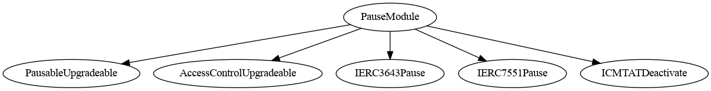
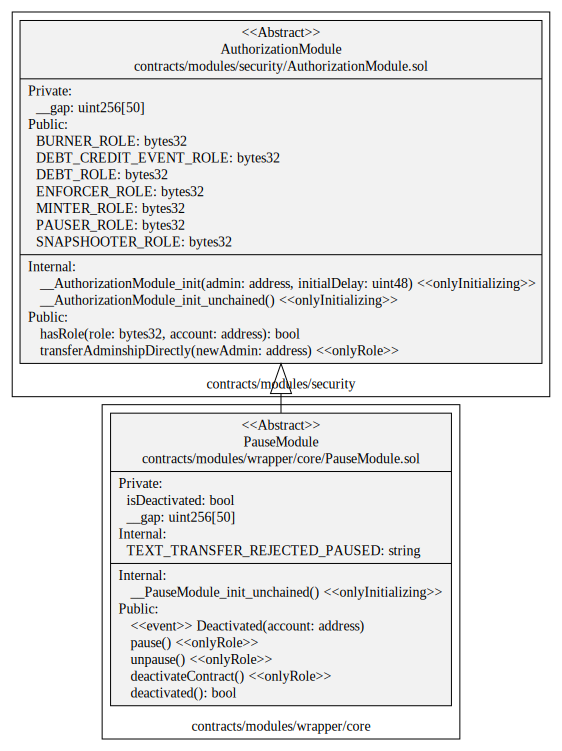

# Pause Module

This document defines the Pause Module for the CMTA Token specification.

[TOC]

## Rationale

> The issuer must be able to “pause” the smart contract, to prevent execution of transactions on the distributed ledger until the issuer puts an end to the pause. This function can be used to block transactions in case of a “hard fork” of the distributed ledger, pending a decision of the issuer as to which version of the distributed ledger it will support.

## Schema

### Inheritance



### UML



### Graph


## Sūrya's Description Report

### Files Description Table


| File Name                              | SHA-1 Hash                               |
| -------------------------------------- | ---------------------------------------- |
| ./modules/wrapper/core/PauseModule.sol | 5f48d5b8b0d5e26e5939aa45e58a0bbf035ba8e0 |


### Contracts Description Table


|    Contract     |             Type             |                  Bases                   |                |                  |
| :-------------: | :--------------------------: | :--------------------------------------: | :------------: | :--------------: |
|        └        |      **Function Name**       |              **Visibility**              | **Mutability** |  **Modifiers**   |
|                 |                              |                                          |                |                  |
| **PauseModule** |        Implementation        | PausableUpgradeable, AuthorizationModule |                |                  |
|        └        | __PauseModule_init_unchained |                Internal 🔒                |       🛑        | onlyInitializing |
|        └        |            pause             |                 Public ❗️                 |       🛑        |     onlyRole     |
|        └        |           unpause            |                 Public ❗️                 |       🛑        |     onlyRole     |
|        └        |      deactivateContract      |                 Public ❗️                 |       🛑        |     onlyRole     |
|        └        |         deactivated          |                 Public ❗️                 |                |       NO❗️        |


### Legend

| Symbol | Meaning                   |
| :----: | ------------------------- |
|   🛑    | Function can modify state |
|   💵    | Function is payable       |

## API for Ethereum

This section describes the Ethereum API of the Pause Module.

### Functions

#### `pause()`

##### Definition:

```solidity
function pause() 
public onlyRole(PAUSER_ROLE)
```

##### Description:

Pause all the token transfers.
This function doesn't affect issuance, redemption, and approves.
Only authorized users are allowed to call this function.

#### `unpause()`

##### Definition:

```solidity
function unpause() 
public onlyRole(PAUSER_ROLE)
```

Unpause token transfers.
Only authorized users are allowed to call this function.

#### `unpause()`

##### Definition:

```solidity
function unpause() 
public onlyRole(PAUSER_ROLE)
```

Unpause token transfers.
Only authorized users are allowed to call this function.


`deactivateContract() `

##### Definition:

```solidity
function deactivateContract()
public onlyRole(DEFAULT_ADMIN_ROLE)
```

This function set the variable `isDeactivated` to true.
In standalone mode, this operation is irreversible, it is not possible to rollback*******.

This function puts also the contract in the pause state
The variable `isDeactivated` will also have an impact on the function `unpause`. This one will revert if the previous variable is set to true, thus the contract will be in the pause state forever*******.

***With a proxy, it is still possible to rollback by deploying a new implementation.

### Events

#### `Paused(address)`

Origin: OpenZeppelin (PausableUpgradeable)

##### Definition:

```solidity
event Paused(address account)
```

##### Description:

Emitted when token transfers were paused.

#### `Unpaused(address)`

##### Definition:

```solidity
event Unpaused(address account)
```

##### Description:

Emitted when token transfers were unpaused.
