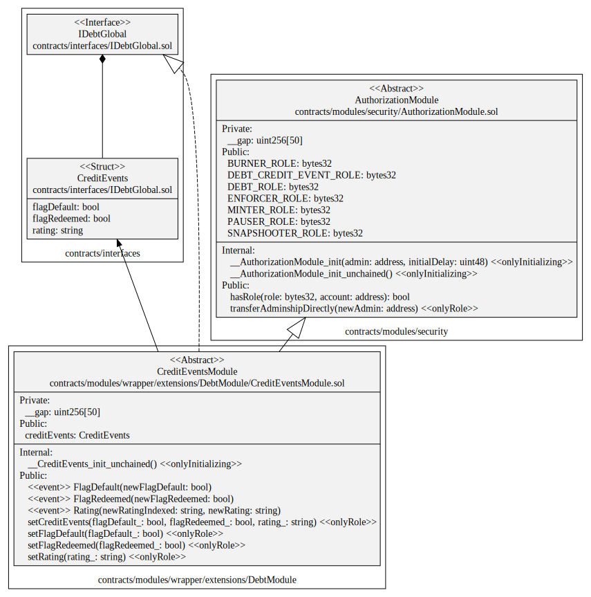

# CreditEvents Module

This document defines CreditEvents Module for the CMTA Token specification.

[TOC]

## Rationale

> A number of events may occur during the lifetime of a debt instrument. Contrary to corporate actions, some of these events typically involve third parties (e.g. a bond agent or a rating agency). The issuer may in such cases wish to delegate the relevant functions to the relevant third parties. 

## Schema

### Inheritance


### UML



### Graph


## Sūrya's Description Report

### Files Description Table


| File Name                                  | SHA-1 Hash                               |
| ------------------------------------------ | ---------------------------------------- |
| ./modules/security/AuthorizationModule.sol | 652daabbe1ec856e47690c07206fe785f2c4ae8f |


### Contracts Description Table


|        Contract         |                 Type                 |                   Bases                   |                |                  |
| :---------------------: | :----------------------------------: | :---------------------------------------: | :------------: | :--------------: |
|            └            |          **Function Name**           |              **Visibility**               | **Mutability** |  **Modifiers**   |
|                         |                                      |                                           |                |                  |
| **AuthorizationModule** |            Implementation            | AccessControlDefaultAdminRulesUpgradeable |                |                  |
|            └            |      __AuthorizationModule_init      |                Internal 🔒                 |       🛑        | onlyInitializing |
|            └            | __AuthorizationModule_init_unchained |                Internal 🔒                 |                | onlyInitializing |
|            └            |               hasRole                |                 Public ❗️                  |                |       NO❗️        |
|            └            |      transferAdminshipDirectly       |                 Public ❗️                  |       🛑        |     onlyRole     |


### Legend

| Symbol | Meaning                   |
| :----: | ------------------------- |
|   🛑    | Function can modify state |
|   💵    | Function is payable       |

## API for Ethereum

This section describes the Ethereum API of CreditEvents Module.

### Functions

#### `setCreditEvents(bool,bool,string)`

##### Definition:

```solidity
function setCreditEvents(bool flagDefault_,bool flagRedeemed_,string memory rating_) 
public onlyRole(DEBT_CREDIT_EVENT_ROLE)
```

##### Description:

Set the optional Credit Events  with the different parameters.
Only authorized users are allowed to call this function.

#### `setFlagDefault(bool flagDefault_)`

##### Definition:

```solidity
function setFlagDefault(bool flagDefault_) 
public onlyRole(DEBT_CREDIT_EVENT_ROLE)
```

##### Description:

Set the optional `flagDefault` to the given `flagDefault_`.
Only authorized users are allowed to call this function.

#### `setFlagRedeemed (bool)`

##### Definition:

```solidity
function setFlagRedeemed(bool flagRedeemed_) 
public onlyRole(DEBT_CREDIT_EVENT_ROLE) 
```

##### Description:

Set the optional `flagRedeemed` to the given `flagRedeemed`.
Only authorized users are allowed to call this function.

#### `setRating(string)`

##### Definition:

```solidity
function setRating(string memory rating_) 
public onlyRole(DEBT_CREDIT_EVENT_ROLE)
```

##### Description:

Set the optional attribute `rating` to the given `rating_`.
Only authorized users are allowed to call this function.


### Events

#### ` FlagDefault(bool`

##### Definition:

```solidity
event FlagDefault(bool indexed newFlagDefault)
```

##### Description:

Emitted when the attribute `flagDefault` is set.

#### `FlagRedeemed(bool)`

##### Definition:

```solidity
event FlagRedeemed(bool indexed newFlagRedeemed)
```

##### Description:

Emitted when the attribute `flagRedeemed` is set.

#### `Rating(string, string)`

##### Definition:

```solidity
event Rating(string indexed newRatingIndexed, string newRating)
```

##### Description:

Emitted when the attribute `rating` is set.
