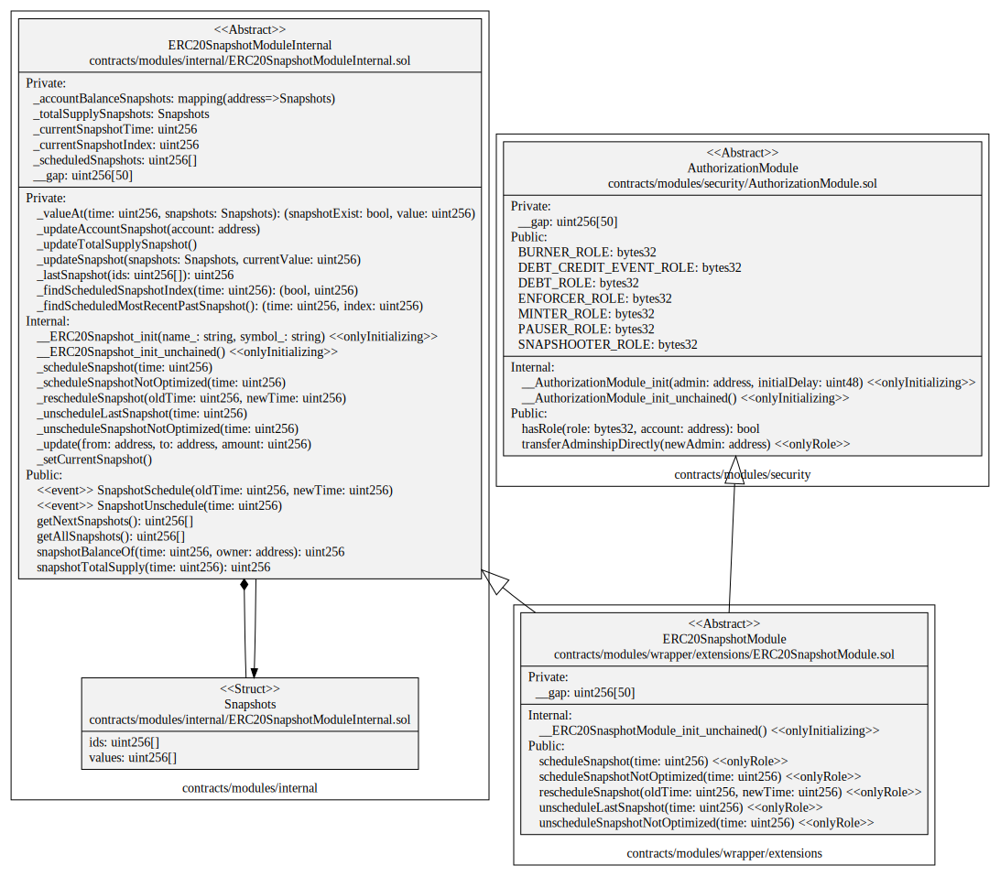

# ERC20Snapshot Module

This document defines the ERC20Snapshot Module for the CMTA Token specification. 

Warning: 

> This module was not audited during the audit made by ABDK and it is no longer imported by default inside the CMTAT.
>
> If you want to add this module, you have to uncomment the specific lines "SnapshotModule" inside the file `CMTAT_BASE.sol`.
>
> Be warned that this module may possibly contain security flaws.

[TOC]

## Rationale

> In relation to distributions or the exercise of rights attached to tokenized securities, it is necessary to determine the number of tokens held by certain users at a certain point in time to allow issuers to carry out certain corporate actions such as dividend or interest payments. 
>
> Such moments are generally referred to in practice as the "record date" or the "record time" (i.e. the time that is relevant to determine the eligibility of security holders for the relevant corporate action). 
>
> The snapshot functions to determine the number of tokens recorded on the various ledger addresses at a specific point in time and to use that information to carry out transactions on-chain.

## Schema

### Inheritance

#### SnapshotModule


#### SnapshotModuleInternal


### UML



### Graph

#### SnapshotModule


#### SnapshotModuleInternal


## Sūrya's Description Report

### Legend

| Symbol | Meaning                   |
| :----: | ------------------------- |
|   🛑    | Function can modify state |
|   💵    | Function is payable       |

### SnapshotModule

#### Files Description Table


| File Name                                            | SHA-1 Hash                               |
| ---------------------------------------------------- | ---------------------------------------- |
| ./modules/wrapper/extensions/ERC20SnapshotModule.sol | fbe645e4def4944ea02fa9b07ecd3dfe367ff725 |


#### Contracts Description Table


|        Contract         |                 Type                 |                      Bases                       |                |                  |
| :---------------------: | :----------------------------------: | :----------------------------------------------: | :------------: | :--------------: |
|            └            |          **Function Name**           |                  **Visibility**                  | **Mutability** |  **Modifiers**   |
|                         |                                      |                                                  |                |                  |
| **ERC20SnapshotModule** |            Implementation            | ERC20SnapshotModuleInternal, AuthorizationModule |                |                  |
|            └            | __ERC20SnasphotModule_init_unchained |                    Internal 🔒                    |       🛑        | onlyInitializing |
|            └            |           scheduleSnapshot           |                     Public ❗️                     |       🛑        |     onlyRole     |
|            └            |     scheduleSnapshotNotOptimized     |                     Public ❗️                     |       🛑        |     onlyRole     |
|            └            |          rescheduleSnapshot          |                     Public ❗️                     |       🛑        |     onlyRole     |
|            └            |        unscheduleLastSnapshot        |                     Public ❗️                     |       🛑        |     onlyRole     |
|            └            |    unscheduleSnapshotNotOptimized    |                     Public ❗️                     |       🛑        |     onlyRole     |

### SnapshotModuleInternal

#### Files Description Table


| File Name                                          | SHA-1 Hash                               |
| -------------------------------------------------- | ---------------------------------------- |
| ./modules/internal/ERC20SnapshotModuleInternal.sol | 12feb821b3a921eadf5f9d1c69eaf6406a44a4d0 |


#### Contracts Description Table


|            Contract             |                 Type                 |      Bases       |                |                  |
| :-----------------------------: | :----------------------------------: | :--------------: | :------------: | :--------------: |
|                └                |          **Function Name**           |  **Visibility**  | **Mutability** |  **Modifiers**   |
|                                 |                                      |                  |                |                  |
| **ERC20SnapshotModuleInternal** |            Implementation            | ERC20Upgradeable |                |                  |
|                └                |         __ERC20Snapshot_init         |    Internal 🔒    |       🛑        | onlyInitializing |
|                └                |    __ERC20Snapshot_init_unchained    |    Internal 🔒    |       🛑        | onlyInitializing |
|                └                |          _scheduleSnapshot           |    Internal 🔒    |       🛑        |                  |
|                └                |    _scheduleSnapshotNotOptimized     |    Internal 🔒    |       🛑        |                  |
|                └                |         _rescheduleSnapshot          |    Internal 🔒    |       🛑        |                  |
|                └                |       _unscheduleLastSnapshot        |    Internal 🔒    |       🛑        |                  |
|                └                |   _unscheduleSnapshotNotOptimized    |    Internal 🔒    |       🛑        |                  |
|                └                |           getNextSnapshots           |     Public ❗️     |                |       NO❗️        |
|                └                |           getAllSnapshots            |     Public ❗️     |                |       NO❗️        |
|                └                |          snapshotBalanceOf           |     Public ❗️     |                |       NO❗️        |
|                └                |         snapshotTotalSupply          |     Public ❗️     |                |       NO❗️        |
|                └                |               _update                |    Internal 🔒    |       🛑        |                  |
|                └                |               _valueAt               |    Private 🔐     |                |                  |
|                └                |        _updateAccountSnapshot        |    Private 🔐     |       🛑        |                  |
|                └                |      _updateTotalSupplySnapshot      |    Private 🔐     |       🛑        |                  |
|                └                |           _updateSnapshot            |    Private 🔐     |       🛑        |                  |
|                └                |         _setCurrentSnapshot          |    Internal 🔒    |       🛑        |                  |
|                └                |            _lastSnapshot             |    Private 🔐     |                |                  |
|                └                |     _findScheduledSnapshotIndex      |    Private 🔐     |                |                  |
|                └                | _findScheduledMostRecentPastSnapshot |    Private 🔐     |                |                  |


## API for Ethereum

This section describes the Ethereum API of the Snapshot Module.

### Functions

#### Setter

##### `scheduleSnapshot(uint256)`

###### Definition:

```solidity
function scheduleSnapshot(uint256 time) 
public onlyRole(SNAPSHOOTER_ROLE)
```

###### Description:

Schedule a snapshot at the given `time` specified as a number of seconds since epoch.

Time has to be greater that the current time and  the latest scheduled snapshot. There have to be no other already created snapshots at this time.
Only authorized users are allowed to call this function.

##### `scheduleSnapshotNotOptimized(uint256)`

###### Definition:

```solidity
function scheduleSnapshotNotOptimized(uint256 time) 
public onlyRole(SNAPSHOOTER_ROLE)
```

###### Description:

Schedule a snapshot at the given `time` specified as a number of seconds since epoch. 

Time has to be greater that the current time. There have to be no other already created snapshots at this time.
Only authorized users are allowed to call this function.

This function is not optimized because it moves all snapshots situated before it one position to the right.

##### `rescheduleSnapshot(uint256,uint256)`

###### Definition:

```solidity
function rescheduleSnapshot(uint256 oldTime,uint256 newTime) 
public onlyRole(SNAPSHOOTER_ROLE)
```

###### Description:

Reschedule the scheduled, but not yet created snapshot with the given `oldTime` to be created at the given `newTime` specified as a number of seconds since epoch.
The `newTime` cannot be before the time of the previous scheduled, but not yet created snapshot, or after the time of the next scheduled snapshot.
The function returns the original `time` the snapshot was scheduled at.
Only authorized users are allowed to call this function.

##### `unscheduleLastSnapshot(uint)`

###### Definition:

```solidity
function unscheduleLastSnapshot(uint256 time) 
public onlyRole(SNAPSHOOTER_ROLE)
```

###### Description:

Cancel creation of the scheduled, but not yet created snapshot with the given `time`.
There should not be any other snapshots scheduled after this one.
Only authorized users are allowed to call this function.

##### `unscheduleSnapshotNotOptimized(uint256)`

###### Definition:

```solidity
function unscheduleSnapshotNotOptimized(uint256 time) 
public onlyRole(SNAPSHOOTER_ROLE)
```

###### Description:

Cancel creation of the scheduled, but not yet created snapshot with the given `time`.

This function is not optimized because it moves all snapshots situated after it one position to the left

Only authorized users are allowed to call this function.

#### Getter

##### `getNextSnapshots()`

###### Definition:

```solidity
function getNextSnapshots() 
public view 
returns (uint256[] memory)
```

###### Description:

Return the next scheduled snapshots

##### `getAllSnapshots()`

###### Definition:

```solidity
function getAllSnapshots() 
public view 
returns (uint256[] memory)
```

###### Description:

Return all snapshots (past and future)

##### `snapshotTotalSupply(uint256)`

###### Definition:

```solidity
function snapshotTotalSupply(uint256 time) 
public view 
returns (uint256)
```

###### Description:

Return the total number of token in circulation at the time when the snapshot with the given `time` was created.

##### `snapshotBalanceOf(uint256,address)`

###### Definition:

```solidity
function snapshotBalanceOf(uint256 time,address owner) 
public view 
returns (uint256)
```

###### Description:

Return the number of tokens owned by the given `owner` at the time when the snapshot with the given `time` was created.

### Events

#### `SnapshotSchedule(uint256,uint256)`

##### Definition:

```solidity
 event SnapshotSchedule(uint256 indexed oldTime, uint256 indexed newTime)
```

##### Description:

Emitted when the snapshot with the specified `oldTime` was scheduled or rescheduled at the specified `newTime`.

#### `SnapshotUnschedule(uint256)`

##### Definition:

```solidity
event SnapshotUnschedule(uint256 indexed time)
```

##### Description:

Emitted when the scheduled snapshot with the specified `time` was cancelled.
