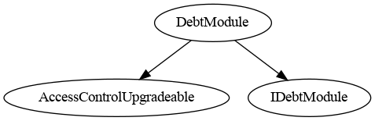

# Debt Module

This document defines Debt Module for the CMTA Token specification.

[TOC]

## Schema

### Inheritance

### Graph

## Sūrya's Description Report

### Files Description Table

| File Name                                   | SHA-1 Hash       |
| ------------------------------------------- | ---------------- |
| ./modules/wrapper/extensions/DebtModule.sol | [object Promise] |

### Contracts Description Table

|    Contract    |            Type             |              Bases               |                |                  |
| :------------: | :-------------------------: | :------------------------------: | :------------: | :--------------: |
|       └        |      **Function Name**      |          **Visibility**          | **Mutability** |  **Modifiers**   |
|                |                             |                                  |                |                  |
| **DebtModule** |       Implementation        | AuthorizationModule, IDebtEngine |                |                  |
|       └        | __DebtModule_init_unchained |            Internal 🔒            |       🛑        | onlyInitializing |
|       └        |         debtEngine          |             Public ❗️             |                |       NO❗️        |
|       └        |        setDebtEngine        |            External ❗️            |       🛑        |     onlyRole     |
|       └        |            debt             |             Public ❗️             |                |       NO❗️        |
|       └        |        creditEvents         |             Public ❗️             |                |       NO❗️        |
|       └        |    _getDebtModuleStorage    |            Private 🔐             |                |                  |

### Legend

| Symbol | Meaning                   |
| :----: | ------------------------- |
|   🛑    | Function can modify state |
|   💵    | Function is payable       |

## API for Ethereum

This section describes the Ethereum API of Debt Module.

<To do>
