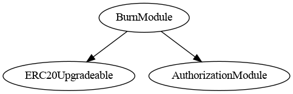
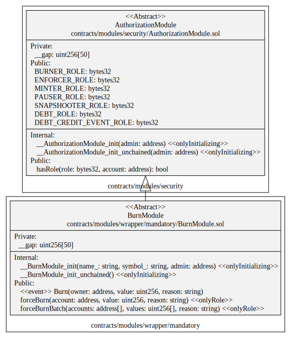
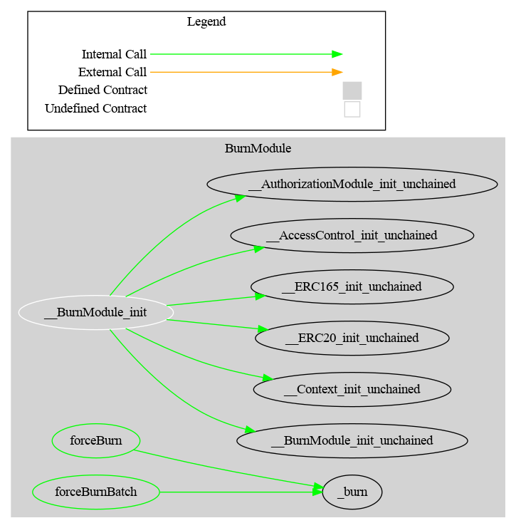

# Burn Module

This document defines Burn Module for the CMTA Token specification.

[TOC]


## Rationale

> This function allows the issuer to destroy specific tokens that are recorded on a distributed ledger address. This function is meant to be used if the issuer cancels tokenized shares (e.g. if it reduces its share capital, if it has decided to have the shares in a different form (e.g. “simple” uncertificated securities within the meaning of Article 973c CO or paper certificates), or to comply with a court order requiring the cancellation of tokens pursuant to Article 973h CO).

## Schema

### Inheritance



### UML



### Graph




## Sūrya's Description Report

### Files Description Table


| File Name                                  | SHA-1 Hash                               |
| ------------------------------------------ | ---------------------------------------- |
| ./modules/wrapper/mandatory/BurnModule.sol | 3547e217049388e5b1a48524255301aac8d301de |


### Contracts Description Table


|    Contract    |            Type             |                 Bases                 |                |                  |
| :------------: | :-------------------------: | :-----------------------------------: | :------------: | :--------------: |
|       └        |      **Function Name**      |            **Visibility**             | **Mutability** |  **Modifiers**   |
|                |                             |                                       |                |                  |
| **BurnModule** |       Implementation        | ERC20Upgradeable, AuthorizationModule |                |                  |
|       └        |      __BurnModule_init      |              Internal 🔒               |       🛑        | onlyInitializing |
|       └        | __BurnModule_init_unchained |              Internal 🔒               |       🛑        | onlyInitializing |
|       └        |          forceBurn          |               Public ❗️                |       🛑        |     onlyRole     |


### Legend

| Symbol | Meaning                   |
| :----: | ------------------------- |
|   🛑    | Function can modify state |
|   💵    | Function is payable       |

## API for Ethereum

This section describes the Ethereum API of Burn Module.

### Functions

#### `forceBurn(address,uint256,string)`

##### Signature:

```solidity
function forceBurn(address account,uint256 amount,string memory reason) 
public onlyRole(BURNER_ROLE)
```

##### Description:

Redeem the given `amount` of tokens from the given `account`.
Only authorized users are allowed to call this function.

### Events

#### `Burn(address,uint,string)`

##### Signature:

```solidity
event Burn(address indexed owner, uint256 amount, string reason)
```

##### Description:

Emitted when the specified `amount` of tokens was burnt from the specified `account`.
