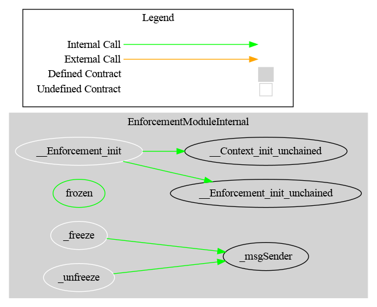

# Enforcement Module

This document defines Enforcement Module for the CMTA Token specification.

[TOC]

## Schema

### Inheritance

#### EnforcementModule


#### EnforcementModuleInternal


### UML


### Graph

#### EnforcementModule


#### EnforcementModuleInternal




## Sūrya's Description Report

### Legend

| Symbol | Meaning                   |
| :----: | ------------------------- |
|   🛑    | Function can modify state |
|   💵    | Function is payable       |

### EnforcementModule

#### Files Description Table


| File Name                                         | SHA-1 Hash                               |
| ------------------------------------------------- | ---------------------------------------- |
| ./modules/wrapper/mandatory/EnforcementModule.sol | 84318c8ac00b97b8d4c0d264ec01c64efe7bfb0e |


#### Contracts Description Table


|       Contract        |                Type                |                     Bases                      |                |                  |
| :-------------------: | :--------------------------------: | :--------------------------------------------: | :------------: | :--------------: |
|           └           |         **Function Name**          |                 **Visibility**                 | **Mutability** |  **Modifiers**   |
|                       |                                    |                                                |                |                  |
| **EnforcementModule** |           Implementation           | EnforcementModuleInternal, AuthorizationModule |                |                  |
|           └           |      __EnforcementModule_init      |                   Internal 🔒                   |       🛑        | onlyInitializing |
|           └           | __EnforcementModule_init_unchained |                   Internal 🔒                   |       🛑        | onlyInitializing |
|           └           |               freeze               |                    Public ❗️                    |       🛑        |     onlyRole     |
|           └           |              unfreeze              |                    Public ❗️                    |       🛑        |     onlyRole     |

### EnforcementModuleInternal

#### Files Description Table


| File Name                                        | SHA-1 Hash                               |
| ------------------------------------------------ | ---------------------------------------- |
| ./modules/internal/EnforcementModuleInternal.sol | 53c926de5a246388e569a30d9762a4d26f97de21 |


#### Contracts Description Table


|           Contract            |             Type             |               Bases               |                |                  |
| :---------------------------: | :--------------------------: | :-------------------------------: | :------------: | :--------------: |
|               └               |      **Function Name**       |          **Visibility**           | **Mutability** |  **Modifiers**   |
|                               |                              |                                   |                |                  |
| **EnforcementModuleInternal** |        Implementation        | Initializable, ContextUpgradeable |                |                  |
|               └               |      __Enforcement_init      |            Internal 🔒             |       🛑        | onlyInitializing |
|               └               | __Enforcement_init_unchained |            Internal 🔒             |       🛑        | onlyInitializing |
|               └               |            frozen            |             Public ❗️              |                |       NO❗️        |
|               └               |           _freeze            |            Internal 🔒             |       🛑        |                  |
|               └               |          _unfreeze           |            Internal 🔒             |       🛑        |                  |

## API for Ethereum

This section describes the Ethereum API of the Enforcement Module.

### Functions

#### `freeze(address,string)`

##### Definition:

```solidity
function freeze(address account,string memory reason) 
public onlyRole(ENFORCER_ROLE) 
returns (bool)
```

#### Description:

Prevents `account` to perform any transfer.
Only authorized users are allowed to call this function.
Returns `true` if the address is not yet frozen, `false` otherwise.

#### `unfreeze(address,string)`

##### Definition:

```solidity
function unfreeze(address account,string memory reason) 
public onlyRole(ENFORCER_ROLE) 
returns (bool)
```

#### Description:

Re-authorizes `account` to perform transfers if it was frozen.
Only authorized users are allowed to call this function.
Returns `true` if the address was frozen, `false` otherwise.

#### `frozen(address)`

Origin: EnforcementModuleInternal

##### Definition:

```solidity
function frozen(address account) 
public view virtual 
returns (bool)
```

##### Description:

Tell, whether the given `account` is frozen.

### Events


#### `Freeze(address,address)`

##### Definition:

```solidity
    event Freeze (address indexed enforcer, address indexed owner)
```

##### Description:

Emitted when address `owner` is frozen by `enforcer`.

#### `Unfreeze(address,address)`

##### Definition:

```solidity
    event Unfreeze (address indexed enforcer, address indexed owner)
```

##### Description:

Emitted when address `owner` is unfrozen by `enforcer`.
