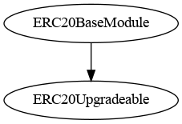
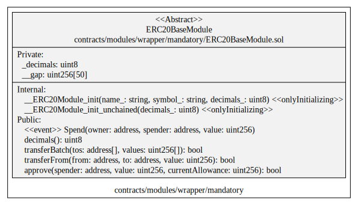
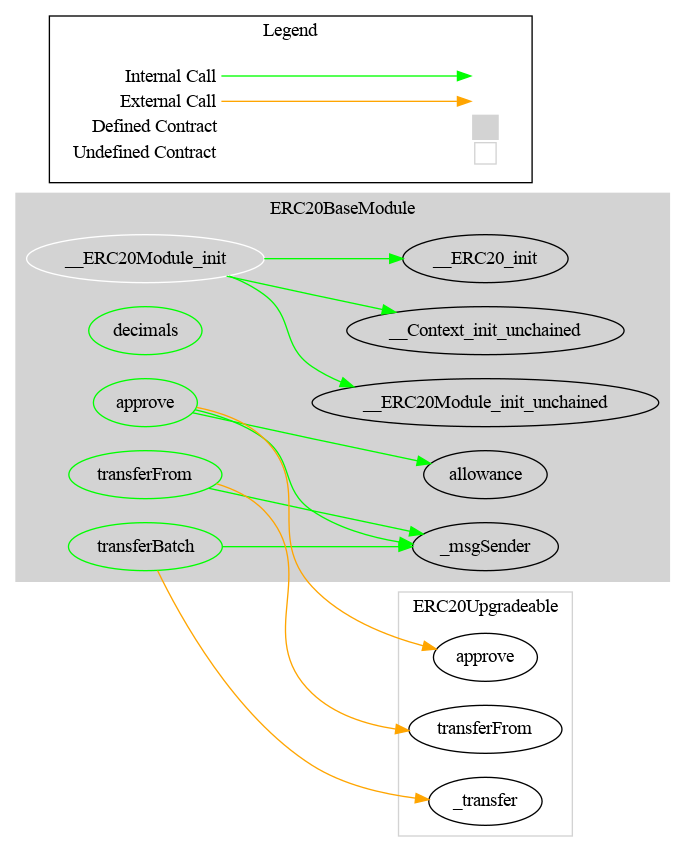

# ERC20Base Module

This document defines Base Module for the CMTA Token specification.

[TOC]


## Rationale

The ERC20Base Module sets forth the ERC20 basic functionalities a token must have to  be a fungible token circulating on a blockchain.

## Schema

### Inheritance



### UML



### Graph



## Sūrya's Description Report

### Files Description Table


| File Name                                       | SHA-1 Hash                               |
| ----------------------------------------------- | ---------------------------------------- |
| ./modules/wrapper/mandatory/ERC20BaseModule.sol | fdaf8d8a710a4ae6166fb0e491018c559acb4e89 |


### Contracts Description Table


|      Contract       |             Type             |      Bases       |                |                  |
| :-----------------: | :--------------------------: | :--------------: | :------------: | :--------------: |
|          └          |      **Function Name**       |  **Visibility**  | **Mutability** |  **Modifiers**   |
|                     |                              |                  |                |                  |
| **ERC20BaseModule** |        Implementation        | ERC20Upgradeable |                |                  |
|          └          |      __ERC20Module_init      |    Internal 🔒    |       🛑        | onlyInitializing |
|          └          | __ERC20Module_init_unchained |    Internal 🔒    |       🛑        | onlyInitializing |
|          └          |           decimals           |     Public ❗️     |                |       NO❗️        |
|          └          |         transferFrom         |     Public ❗️     |       🛑        |       NO❗️        |
|          └          |           approve            |     Public ❗️     |       🛑        |       NO❗️        |


### Legend

| Symbol | Meaning                   |
| :----: | ------------------------- |
|   🛑    | Function can modify state |
|   💵    | Function is payable       |

## API for Ethereum

Base Module API for Ethereum blockchain extends the [ERC-20](https://github.com/ethereum/EIPs/blob/master/EIPS/eip-20.md) API, the standard fungible token API for Ethereum.

### Functions

#### `totalSupply()`

Origin: OpenZeppelin (ERC20Upgradeable)

##### Definition:

```solidity
function totalSupply() 
external view 
returns (uint256)
```

##### Description:

Return the total number of tokens currently in circulation.

#### `balanceOf(address)`

Origin: OpenZeppelin (ERC20Upgradeable)

##### Definition:

```solidity
function balanceOf(address account) 
external view 
returns (uint256)
```

##### Description:

Return the number of tokens currently owned by the given `owner`.

#### `transfer(address,uint256)`

Origin: OpenZeppelin (ERC20Upgradeable)

##### Definition:

```solidity
function transfer(address to, uint256 amount) 
external 
returns (bool)
```

##### Description:

Transfer the given `amount` of tokens from the caller to the given `destination` address.
The function returns `true` on success and reverts on error.

#### `approve(address,uint256)`

Origin: OpenZeppelin (ERC20Upgradeable)

##### Definition:

```solidity
function approve(address spender, uint256 amount) 
external 
returns (bool)
```

##### Description:

Allow the given `spender` to transfer at most the given `amount` of tokens from the caller.
The function returns `true` on success and reverts of error.

#### `allowance(address,address)`

Origin: OpenZeppelin (ERC20Upgradeable)

##### Definition:

```solidity
function allowance(address owner, address spender) 
external view 
returns (uint256)
```

##### Description:

Return the number of tokens the given `spender` is currently allowed to transfer from the given `owner`.

#### `approve(address,uint256,uint256)`

##### Definition:

```solidity
function approve(address spender,uint256 amount,uint256 currentAllowance) 
public virtual 
returns (bool)
```

##### Description:

Allow the given `spender` to transfer at most the given `amount` of tokens from the caller.
The function may be successfully executed only when the given `currentAllowance` values equals to the amount of token the spender is currently allowed to transfer from the caller.
The function returns `true` on success and reverts of error.

This function in not defined by ERC-20 and is needed to safely change the allowance.  Consider the following scenario:

1. Alice allows Bob to transfer 100 of her tokens
2. Alice wants to allow Bob to transfer 10 more of her tokens, i.e. 110 of her tokens in total
3. Alice calls `approve (bob, 110)`
4. Bob front runs the Alice's transaction with his own call: `transferFrom (alice, bob, 100)`
5. Bob's transaction transfers 100 tokens from Alice to Bob and reduces the allowance to zero
6. Then Alice's transaction is executed and sets the allowance to 110
7. No Bob executes `transferFrom (alice, bob, 110)` and takes another 110 tokens from Alice

So, Bob got 210 tokens in total, while Alice never means to allow him to transfer more than 110 tokens.

In order to mitigate this kind of attack, Alice at step 3 calls `approve (bob, 110, 100)`.  Such call could only succeed if the allowance is still 100, i.e. Bob's attempt to front run the transaction will make Alice's transaction to fail.

#### `transferFrom(address,address,uint256)`

##### Definition:

```solidity
function transferFrom(address sender,address recipient,uint256 amount) 
public virtual override 
returns (bool)
```

##### Description:

Transfer the given `amount` of tokens from the given `owner` to the given `destination` address.
`sender` and `recipient` cannot be the zero address.
The function returns `true` on success and reverts of error.

### Events

#### `Transfer(address,address,uint256)`

Origin: OpenZeppelin (ERC20Upgradeable)

##### Definition:

```solidity
event Transfer(address indexed from, address indexed to, uint256 value)
```

##### Description:

Emitted when the specified `amount` of tokens was transferred from the specified `origin` address to the specified `destination` address.

#### `Approval(address,address,uint256)`

Origin: OpenZeppelin (ERC20Upgradeable)

##### Definition:

```solidity
event Approval(address indexed owner, address indexed spender, uint256 value)
```

##### Description:

Emitted when the specified `owner` allowed the specified `spender` to transfer the specified `amount` of tokens.

#### `Spend(address,address,uint256)`

##### Definition:

```solidity
event Spend (address indexed owner, address indexed spender, uint256 amount)
```

##### Description:

Emitted when the specified `spender` spends the specified `amount` of the tokens owned by the specified `owner` reducing the corresponding allowance.

This event is not defined by ERC-20 and is needed to track allowance changes.
