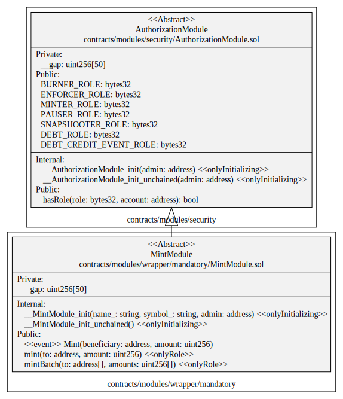
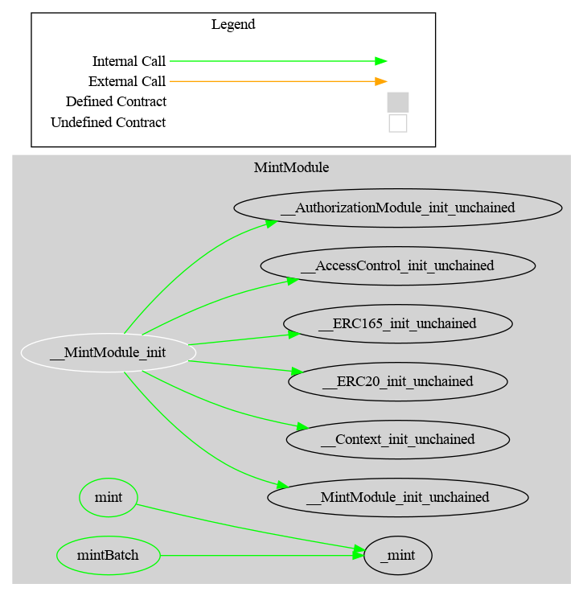

# Mint Module

This document defines Mint Module for the CMTA Token specification.

[TOC]


## Rationale

>  Traditional securities could be issued in different ways.  Bonds are usually issued all at once.  Normal shares could be issued several times, when the issuer wants to raise more capital.  ETF shares are continuously issued on demand.  The Mint Module covers scenarios for CMTA Token specification when the issuer needs to create new tokens in response to securities issuances.

## Schema

### Inheritance


### UML



### Graph




## Sūrya's Description Report

### Files Description Table


| File Name                                  | SHA-1 Hash                               |
| ------------------------------------------ | ---------------------------------------- |
| ./modules/wrapper/mandatory/MintModule.sol | c0300d093480b66e7a9c5acd1a1c46c34f6221bb |


### Contracts Description Table


|    Contract    |            Type             |                 Bases                 |                |                  |
| :------------: | :-------------------------: | :-----------------------------------: | :------------: | :--------------: |
|       └        |      **Function Name**      |            **Visibility**             | **Mutability** |  **Modifiers**   |
|                |                             |                                       |                |                  |
| **MintModule** |       Implementation        | ERC20Upgradeable, AuthorizationModule |                |                  |
|       └        |      __MintModule_init      |              Internal 🔒               |       🛑        | onlyInitializing |
|       └        | __MintModule_init_unchained |              Internal 🔒               |       🛑        | onlyInitializing |
|       └        |            mint             |               Public ❗️                |       🛑        |     onlyRole     |


### Legend

| Symbol | Meaning                   |
| :----: | ------------------------- |
|   🛑    | Function can modify state |
|   💵    | Function is payable       |

## API for Ethereum

This section describes the Ethereum API of Issue Module.

### Function

#### `mint(address,uint256)`

##### Definition:

```solidity
function mint(address to, uint256 amount) 
public onlyRole(MINTER_ROLE)
```

##### Description:

Create the given `amount` of tokens and allocate them to the given  address`to`.
Only authorized users are allowed to call this function.

### Events

#### `Mint(address,uint256)`

##### Definition:


```solidity
event Mint (address indexed beneficiary,uint256 amount)
```

##### Description

Emitted when the specified `amount` of new tokens was created and
allocated to the specified `beneficiary`.

