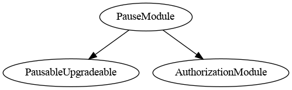
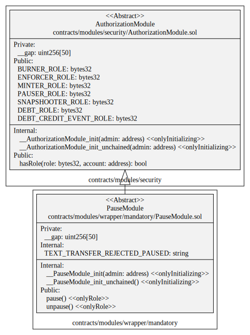
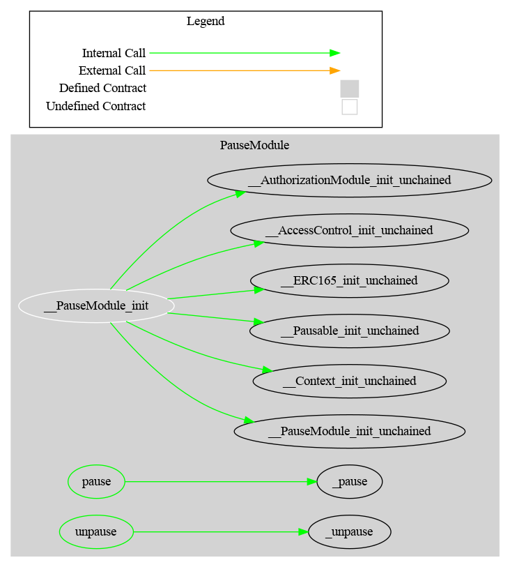

# Pause Module

This document defines the Pause Module for the CMTA Token specification.

[TOC]

## Schema

### Inheritance



### UML



### Graph



## Sūrya's Description Report

### Files Description Table


| File Name                                   | SHA-1 Hash                               |
| ------------------------------------------- | ---------------------------------------- |
| ./modules/wrapper/mandatory/PauseModule.sol | 0350e2f17f517c70804304a8cf24d3337f951f59 |


### Contracts Description Table


|    Contract     |             Type             |                  Bases                   |                |                  |
| :-------------: | :--------------------------: | :--------------------------------------: | :------------: | :--------------: |
|        └        |      **Function Name**       |              **Visibility**              | **Mutability** |  **Modifiers**   |
|                 |                              |                                          |                |                  |
| **PauseModule** |        Implementation        | PausableUpgradeable, AuthorizationModule |                |                  |
|        └        |      __PauseModule_init      |                Internal 🔒                |       🛑        | onlyInitializing |
|        └        | __PauseModule_init_unchained |                Internal 🔒                |       🛑        | onlyInitializing |
|        └        |            pause             |                 Public ❗️                 |       🛑        |     onlyRole     |
|        └        |           unpause            |                 Public ❗️                 |       🛑        |     onlyRole     |


### Legend

| Symbol | Meaning                   |
| :----: | ------------------------- |
|   🛑    | Function can modify state |
|   💵    | Function is payable       |

## API for Ethereum

This section describes the Ethereum API of the Pause Module.

### Functions

#### `pause()`

##### Signature:

```solidity
    function pause ()
    public
```

##### Description:

Pause all the token transfers.
This function doesn't affect issuance, redemption, and approves.
Only authorized users are allowed to call this function.

#### `unpause()`

##### Signature:

Unpause token transfers.
Only authorized users are allowed to call this function.

### Events

#### `Pause()`

##### Signature:

```solidity
    event Pause ()
```

##### Description:

Emitted when token transfers were paused.

#### `Unpause()`

##### Signature:

```solidity
    events Unpause ()
```

##### Description:

Emitted when token transfers were unpaused.
