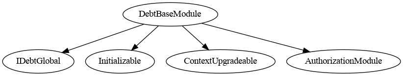
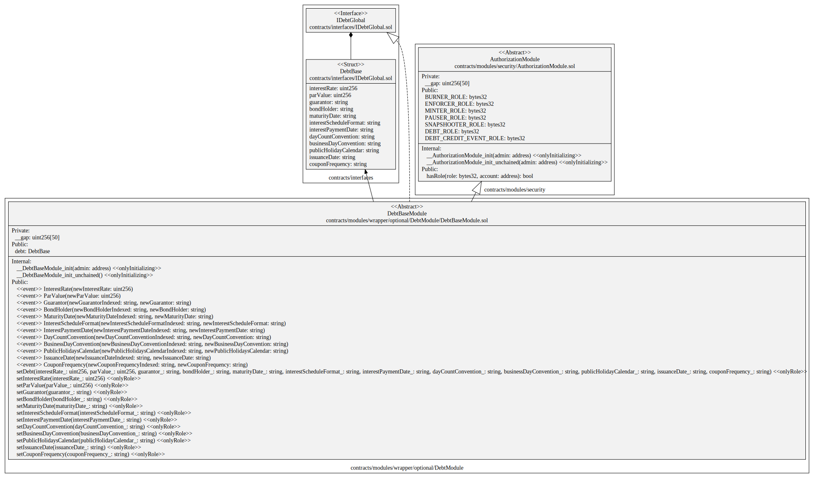
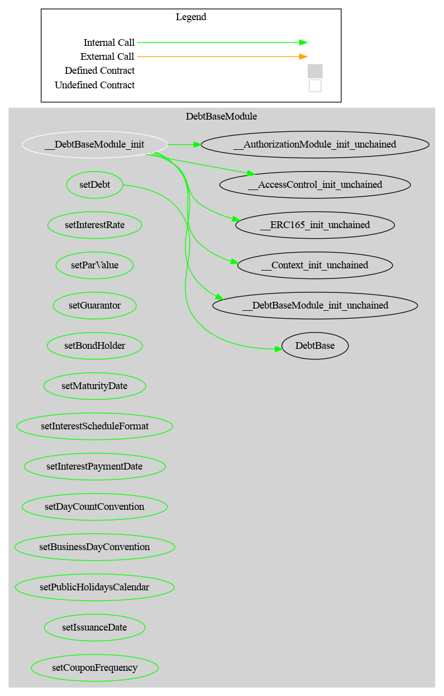

# DebtBase Module

This document defines DebtBase Module for the CMTA Token specification.

[TOC]

## Schema

### Inheritance




### UML



### Graph




## API for Ethereum

This section describes the Ethereum API of Debt Module.

### Functions

#### `setDebt((uint256,uint256,string,string,string,string,string,string,string,string))`

##### Definition:

```solidity
function setDebt(DebtBase memory debt_) 
public onlyRole(DEBT_ROLE)
```

##### Description:

Set the optional Debt  with the different parameters.
Only authorized users are allowed to call this function.

#### `setInterestRate(uint256)`

##### Definition:

```solidity
function setInterestRate(uint256 interestRate_) 
public onlyRole(DEBT_ROLE) 
```

##### Description:

Set the optional interest rate to the given `interestRate_`.
Only authorized users are allowed to call this function.

#### `setParValue(uint256)`

##### Definition:

```solidity
function setParValue (uint256 parValue_) 
public onlyRole(DEFAULT_ADMIN_ROLE)
```

##### Description:

Set the optional `parValue` to the given `parValue_`.
Only authorized users are allowed to call this function.

#### `setGuarantor(string)`

##### Definition:

```solidity
function setGuarantor (string memory guarantor_) 
public onlyRole(DEFAULT_ADMIN_ROLE)
```

##### Description:

Set the optional attribute `Guarantor` to the given `guarantor_`.
Only authorized users are allowed to call this function.

#### `setBondHolder(string)`

##### Definition:

```solidity
function setBondHolder (string memory bondHolder_) 
public onlyRole(DEFAULT_ADMIN_ROLE)
```

##### Description:

Set the optional attribute `bondHolder` to the given `bondHolder_`.
Only authorized users are allowed to call this function.

#### `setMaturityDate(string)`

##### Definition:

```solidity
function setMaturityDate (string memory maturityDate_) 
public onlyRole(DEFAULT_ADMIN_ROLE)
```

##### Description:

Set the optional attribute `maturityDate` to the given `maturityDate_`.
Only authorized users are allowed to call this function.

#### `setInterestScheduleFormat(string)`

##### Definition:

```solidity
function setInterestScheduleFormat (string memory interestScheduleFormat_) 
public onlyRole(DEFAULT_ADMIN_ROLE)
```

##### Description:

Set the optional attribute `interestScheduleFormat` to the given `interestScheduleFormat_`.
Only authorized users are allowed to call this function.

#### `setInterestPaymentDate(string)`

##### Definition:

```solidity
function setInterestPaymentDate (string memory interestPaymentDate_) 
public onlyRole(DEFAULT_ADMIN_ROLE)
```

##### Description:

Set the optional attribute `interestPaymentDate` to the given `interestPaymentDate_`.
Only authorized users are allowed to call this function.

#### `setDayCountConvention(string)`

##### Definition:

```solidity
function setDayCountConvention (string memory dayCountConvention_) 
public onlyRole(DEFAULT_ADMIN_ROLE)
```

##### Description:

Set the optional attribute `dayCountConvention` to the given `interestPaymentDate_`.
Only authorized users are allowed to call this function.

#### `setBusinessDayConvention(string)`

##### Definition:

```solidity
function setBusinessDayConvention (string memory businessDayConvention_) 
public onlyRole(DEFAULT_ADMIN_ROLE)
```

##### Description:

Set the optional attribute `businessDayConvention` to the given `businessDayConvention_`.
Only authorized users are allowed to call this function.

#### ` setPublicHolidaysCalendar(string)`

##### Definition:

```solidity
function setPublicHolidaysCalendar(string memory publicHolidaysCalendar_) 
public onlyRole(DEFAULT_ADMIN_ROLE)
```

##### Description:

Set the optional attribute `publicHolidaysCalendar` to the given `publicHolidaysCalendar_`.
Only authorized users are allowed to call this function.


#### ` setIssuanceDate(string) `

##### Definition:

```solidity
function setIssuanceDate(string memory issuanceDate_) 
```

##### Description:

Set the optional attribute `issuanceDate` to the given `issuanceDate_`.
Only authorized users are allowed to call this function.


#### ` setCouponFrequency(string)`

##### Definition:

```solidity
function setCouponFrequency(string memory couponFrequency_) 
public onlyRole(DEBT_ROLE)
```

##### Description:

Set the optional attribute `couponFrequency` to the given `couponFrequency_`.
Only authorized users are allowed to call this function.

### Events

#### `InterestRate(uint256)`

##### Definition:

```solidity
event InterestRate(uint256 newInterestRate)
```

##### Description:

Emitted when the attribute `Interest Rate` is set.

#### `ParValue(uint256)`

##### Definition:

```solidity
event ParValue(uint256 newParValue)
```

##### Description:

Emitted when the attribute `ParValue` is set.

#### `Guarantor(string, string)`

##### Definition:

```solidity
event Guarantor(string indexed newGuarantorIndexed, string newGuarantor)
```

##### Description:

Emitted when the attribute `Guarantor` is set.

#### `BondHolder(string,string)`

##### Definition:

```solidity
event BondHolder(string indexed newBondHolderIndexed, string newBondHolder)
```

##### Description:

Emitted when the attribute `BondHolder` is set.

#### `MaturityDate(string,string)`

##### Definition:

```solidity
event MaturityDate(
	string indexed newMaturityDateIndexed,
	string newMaturityDate
)
```

##### Description:

Emitted when the attribute `maturityDate` is set.

#### `InterestScheduleFormat(string,string)`

##### Definition:

```solidity
event InterestScheduleFormat(
        string indexed newInterestScheduleFormatIndexed,
        string newInterestScheduleFormat
)
```

##### Description:

Emitted when the attribute `interestScheduleFormat` is set.

#### `InterestPaymentDate(string,string)`

##### Definition:

```solidity
 event InterestPaymentDate(
        string indexed newInterestPaymentDateIndexed,
        string newInterestPaymentDate
)
```

##### Description:

Emitted when the attribute `interestPaymentDate` is set.

#### `DayCountConvention(string,string)`

##### Definition:

```solidity
event DayCountConvention(
	string indexed newDayCountConventionIndexed,
	string newDayCountConvention
)
```

##### Description:

Emitted when the attribute `DayCountConvention` is set.

#### `BusinessDayConvention(string,string)`

##### Definition:

```solidity
event BusinessDayConvention(
	string indexed newBusinessDayConventionIndexed,
	string newBusinessDayConvention
)
```

##### Description:

Emitted when the attribute `BusinessDayConvention` is set.

#### `PublicHolidaysCalendar(string,string)`

##### Definition:

```solidity
event PublicHolidaysCalendar(
	string indexed newPublicHolidaysCalendarIndexed,
	string newPublicHolidaysCalendar
)
```

##### Description:

Emitted when the attribute `PublicHolidaysCalendar` is set.


#### `IssuanceDatee(string,string)`

##### Definition:

```solidity
event IssuanceDate(
	string indexed newIssuanceDateIndexed,
	string newIssuanceDate
)
```

##### Description:

Emitted when the attribute `issuanceDate` is set.

#### `CouponFrequency(string,string)`

##### Definition:

```solidity
event CouponFrequency(
	string indexed newCouponFrequencyIndexed,
	string newCouponFrequency
)
```

##### Description:

Emitted when the attribute `couponFrequency` is set.
