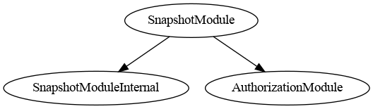
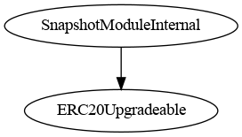
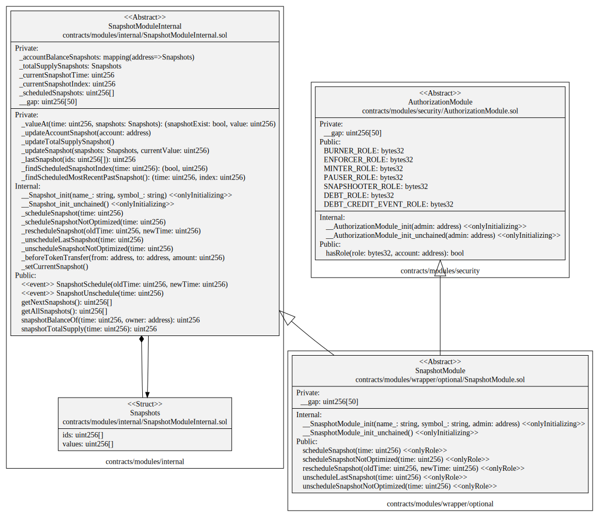

# Snapshot Module

This document defines the Snapshot Module for the CMTA Token specification. 

Warning: 

> This module was not audited during the audit made by ABDK and it is no longer imported by default inside the CMTAT.
>
> If you want to add this module, you have to uncomment the specific lines "SnapshotModule" inside the file `CMTAT_BASE.sol`.
>
> Be warned that this module may possibly contain security flaws.

[TOC]

## Schema

### Inheritance

#### SnapshotModule



#### SnapshotModuleInternal



### UML



### Graph

#### SnapshotModule


#### SnapshotModuleInternal


## Sūrya's Description Report

### Legend

| Symbol | Meaning                   |
| :----: | ------------------------- |
|   🛑    | Function can modify state |
|   💵    | Function is payable       |

### SnapshotModule

#### Files Description Table


| File Name                                     | SHA-1 Hash                               |
| --------------------------------------------- | ---------------------------------------- |
| ./modules/wrapper/optional/SnapshotModule.sol | 940a05eeea32027baf3142c0c736e9679cb846ca |


#### Contracts Description Table


|      Contract      |              Type               |                    Bases                    |                |                  |
| :----------------: | :-----------------------------: | :-----------------------------------------: | :------------: | :--------------: |
|         └          |        **Function Name**        |               **Visibility**                | **Mutability** |  **Modifiers**   |
|                    |                                 |                                             |                |                  |
| **SnapshotModule** |         Implementation          | SnapshotModuleInternal, AuthorizationModule |                |                  |
|         └          |      __SnasphotModule_init      |                 Internal 🔒                  |       🛑        | onlyInitializing |
|         └          | __SnasphotModule_init_unchained |                 Internal 🔒                  |       🛑        | onlyInitializing |
|         └          |        scheduleSnapshot         |                  Public ❗️                   |       🛑        |     onlyRole     |
|         └          |  scheduleSnapshotNotOptimized   |                  Public ❗️                   |       🛑        |     onlyRole     |
|         └          |       rescheduleSnapshot        |                  Public ❗️                   |       🛑        |     onlyRole     |
|         └          |     unscheduleLastSnapshot      |                  Public ❗️                   |       🛑        |     onlyRole     |
|         └          | unscheduleSnapshotNotOptimized  |                  Public ❗️                   |       🛑        |     onlyRole     |

### SnapshotModuleInternal

#### Files Description Table


| File Name                                     | SHA-1 Hash                               |
| --------------------------------------------- | ---------------------------------------- |
| ./modules/internal/SnapshotModuleInternal.sol | 83cd7e3cd8b99c665c628f97ab37391f9dce07c1 |


#### Contracts Description Table


|          Contract          |                 Type                 |      Bases       |                |                  |
| :------------------------: | :----------------------------------: | :--------------: | :------------: | :--------------: |
|             └              |          **Function Name**           |  **Visibility**  | **Mutability** |  **Modifiers**   |
|                            |                                      |                  |                |                  |
| **SnapshotModuleInternal** |            Implementation            | ERC20Upgradeable |                |                  |
|             └              |           __Snapshot_init            |    Internal 🔒    |       🛑        | onlyInitializing |
|             └              |      __Snapshot_init_unchained       |    Internal 🔒    |       🛑        | onlyInitializing |
|             └              |          _scheduleSnapshot           |    Internal 🔒    |       🛑        |                  |
|             └              |    _scheduleSnapshotNotOptimized     |    Internal 🔒    |       🛑        |                  |
|             └              |         _rescheduleSnapshot          |    Internal 🔒    |       🛑        |                  |
|             └              |       _unscheduleLastSnapshot        |    Internal 🔒    |       🛑        |                  |
|             └              |   _unscheduleSnapshotNotOptimized    |    Internal 🔒    |       🛑        |                  |
|             └              |           getNextSnapshots           |     Public ❗️     |                |       NO❗️        |
|             └              |           getAllSnapshots            |     Public ❗️     |                |       NO❗️        |
|             └              |          snapshotBalanceOf           |     Public ❗️     |                |       NO❗️        |
|             └              |         snapshotTotalSupply          |     Public ❗️     |                |       NO❗️        |
|             └              |         _beforeTokenTransfer         |    Internal 🔒    |       🛑        |                  |
|             └              |               _valueAt               |    Private 🔐     |                |                  |
|             └              |        _updateAccountSnapshot        |    Private 🔐     |       🛑        |                  |
|             └              |      _updateTotalSupplySnapshot      |    Private 🔐     |       🛑        |                  |
|             └              |           _updateSnapshot            |    Private 🔐     |       🛑        |                  |
|             └              |         _setCurrentSnapshot          |    Internal 🔒    |       🛑        |                  |
|             └              |            _lastSnapshot             |    Private 🔐     |                |                  |
|             └              |     _findScheduledSnapshotIndex      |    Private 🔐     |                |                  |
|             └              | _findScheduledMostRecentPastSnapshot |    Private 🔐     |                |                  |

## API for Ethereum

This section describes the Ethereum API of the Snapshot Module.

### Functions

#### Setter

##### `scheduleSnapshot(uint)`

###### Signature:

```solidity
    function scheduleSnapshot (uint time)
```

###### Description:

Schedule a snapshot at the given `time` specified as a number of seconds since epoch.

Time has to be greater that the current time and  the latest scheduled snapshot. There have to be no other already created snapshots at this time.
Only authorized users are allowed to call this function.

##### `scheduleSnapshotNotOptimized(uint)`

###### Signature:

```solidity
    function scheduleSnapshotNotOptimized (uint time)
```

###### Description:

Schedule a snapshot at the given `time` specified as a number of seconds since epoch. 

Time has to be greater that the current time. There have to be no other already created snapshots at this time.
Only authorized users are allowed to call this function.

This function is not optimized because it moves all snapshots situated before it one position to the right.

##### `rescheduleSnapshot(uint,uint)`

###### Signature:

```solidity
    function rescheduleSnapshot (uint oldTime, uint newTime)
```

###### Description:

Reschedule the scheduled, but not yet created snapshot with the given `oldTime` to be created at the given `newTime` specified as a number of seconds since epoch.
The `newTime` cannot be before the time of the previous scheduled, but not yet created snapshot, or after the time of the next scheduled snapshot.
The function returns the original `time` the snapshot was scheduled at.
Only authorized users are allowed to call this function.

##### `unscheduleLastSnapshot(uint)`

###### Signature:

```solidity
function unscheduleLastSnapshot(uint256 time)
        public
        onlyRole(SNAPSHOOTER_ROLE)
```

###### Description:

Cancel creation of the scheduled, but not yet created snapshot with the given `time`.
There should not be any other snapshots scheduled after this one.
Only authorized users are allowed to call this function.

##### `unscheduleSnapshotNotOptimized(uint)`

###### Signature:

```solidity
function unscheduleSnapshotNotOptimized(uint256 time)
        public
        onlyRole(SNAPSHOOTER_ROLE)
```

###### Description:

Cancel creation of the scheduled, but not yet created snapshot with the given `time`.

This function is not optimized because it moves all snapshots situated after it one position to the left

Only authorized users are allowed to call this function.

#### Getter

##### `snapshotTotalSupply(uint)`

###### Signature:

```solidity
    function snapshotTotalSupply (uint time)
    public view returns (uint)
```

###### Description:

Return the total number of token in circulation at the time when the snapshot with the given `time` was created.

##### `snapshotBalanceOf(uint,address)`

###### Signature:

```solidity
    function snapshotBalanceOf (uint time, address owner)
    public view returns (uint)
```

###### Description:

Return the number of tokens owned by the given `owner` at the time when the snapshot with the given `time` was created.

### Events

#### `SnapshotSchedule(uint,uint)`

##### Signature:

```solidity
    event SnapshotSchedule (uint indexed oldTime, uint indexed newTime)
```

##### Description:

Emitted when the snapshot with the specified `oldTime` was scheduled or rescheduled at the specified `newTime`.

#### `SnapshotUnscheduling(uint)`

##### Signature:

```solidity
    event SnapshotUnschedule (uint indexed time)
```

##### Description:

Emitted when the scheduled snapshot with the specified `time` was cancelled.
