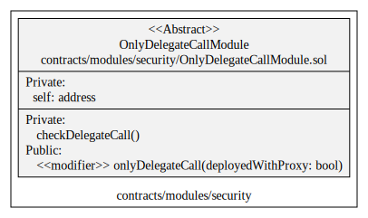
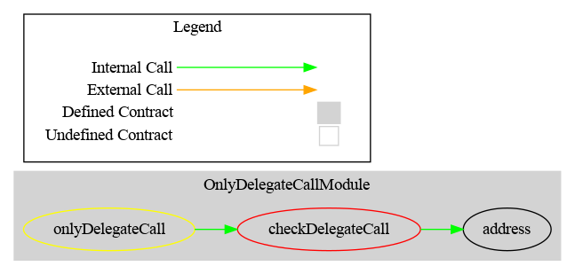

# OnlyDelegateCallModule

This document defines the module `OnlyDelegateCallModule`.

[TOC]

## Rationale

> When a contract is deployed with a proxy, insure that some functions (e.g. delegatecall and selfdestruct) can only be triggered through proxies and not on the implementation contract itself.
>
> Reference: [docs.openzeppelin.com - delegatecall-selfdestruct](https://docs.openzeppelin.com/upgrades-plugins/1.x/faq#delegatecall-selfdestruct)

## Schema

### UML

### Graph

## Sūrya's Description Report

### Files Description Table

| File Name                                     | SHA-1 Hash                               |
| --------------------------------------------- | ---------------------------------------- |
| ./modules/security/OnlyDelegateCallModule.sol | 2250d7bf8245f6ca9d694ac7b29b76421f45ff33 |

### Contracts Description Table

|          Contract          |       Type        |     Bases      |                |               |
| :------------------------: | :---------------: | :------------: | :------------: | :-----------: |
|             └              | **Function Name** | **Visibility** | **Mutability** | **Modifiers** |
|                            |                   |                |                |               |
| **OnlyDelegateCallModule** |  Implementation   |                |                |               |
|             └              | checkDelegateCall |   Private 🔐    |                |               |

### Legend

| Symbol | Meaning                   |
| :----: | ------------------------- |
|   🛑    | Function can modify state |
|   💵    | Function is payable       |

## API for Ethereum

This module does not provide any public or external functions
