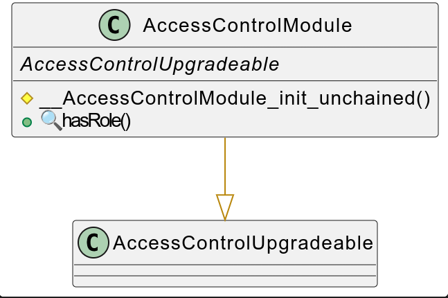
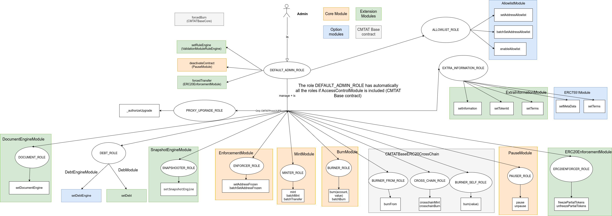
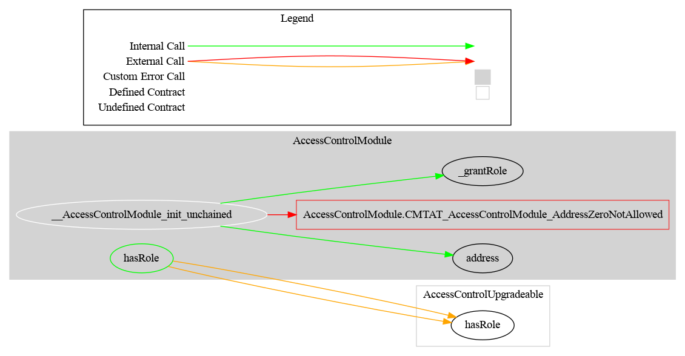

# Access Control Module

This document defines Authorization Module for the CMTA Token specification.

[TOC]

## Rationale

>  There are many operations that only authorized users are allowed to perform, such as issuing new tokens. Thus we need to manage authorization in a centralized way.
> Access Module covers authorization use cases for the CMTA Token specification.

## Schema

### RBAC

This diagram shows the different roles.

- The rectangle represent the functions
- The circle represents the roles

The actor admin, defined inside the constructor or with the function `initialize` has the role `DEFAULT_ADMIN_ROLE`.

The DEFAULT_ADMIN_ROLE has automatically all the roles.

This behavior is implemented by overriding the function `hasRole` from OpenZeppelin

### Graph

## rc1 — Document Composition Level (Hierarchy Refactor)

In v3.3.0-rc1, a new `CMTATBaseDocument` contract was introduced at **level 1** in the inheritance hierarchy. It is a thin composition wrapper (`abstract contract CMTATBaseDocument is DocumentERC1643Module {}`) that places document module composition at a distinct inheritance level below the RBAC layer.

Key points:
- `DOCUMENT_ROLE` is defined as a constant in `DocumentERC1643Module` (the wrapper module).
- `_authorizeDocumentManagement()` is declared abstract in `DocumentERC1643Module` and is inherited through `CMTATBaseDocument` without implementation.
- The concrete implementation of `_authorizeDocumentManagement()` remains in `CMTATBaseAccessControl` (level 2): `onlyRole(DOCUMENT_ROLE)`.

The practical effect is that the document composition level is now separable from RBAC management, and the dependency graph makes the layering explicit.

## API for Ethereum

See [docs.openzeppelin.com - AccessControl](https://docs.openzeppelin.com/contracts/5.x/api/access#AccessControl)

For the full role and function table, see [access-control.md](../../technical/access-control.md).
