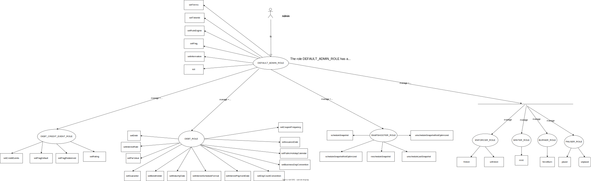
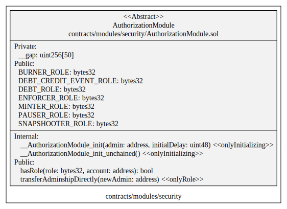
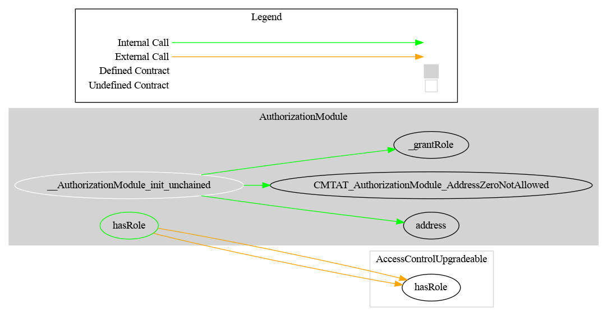

# Authorization Module

This document defines Authorization Module for the CMTA Token specification.

[TOC]

## Rationale

>  There are many operations that only authorized users are allowed to perform, such as issuing new tokens. Thus we need to manage authorization in a centralized way.
> Authorization Module covers authorization use cases for the CMTA Token specification.

## Schema

### RBAC

This diagram shows the different roles.

- The rectangle represent the functions
- The circle represents the roles

The actor admin, defined inside the constructor or with the function `initialize` has the role `DEFAULT_ADMIN_ROLE`.

The DEFAULT_ADMIN_ROLE has automatically all the roles.

This behavior is implemented by overriding the function `hasRole` from OpenZeppelin



### UML



### Graph



## Sūrya's Description Report

### Files Description Table


| File Name                                  | SHA-1 Hash                               |
| ------------------------------------------ | ---------------------------------------- |
| ./modules/security/AuthorizationModule.sol | b816390e7b0da6bbd9602af5a7f92dfc0095bbcd |


### Contracts Description Table


|        Contract         |                 Type                 |          Bases           |                |                  |
| :---------------------: | :----------------------------------: | :----------------------: | :------------: | :--------------: |
|            └            |          **Function Name**           |      **Visibility**      | **Mutability** |  **Modifiers**   |
|                         |                                      |                          |                |                  |
| **AuthorizationModule** |            Implementation            | AccessControlUpgradeable |                |                  |
|            └            |      __AuthorizationModule_init      |        Internal 🔒        |       🛑        | onlyInitializing |
|            └            | __AuthorizationModule_init_unchained |        Internal 🔒        |       🛑        | onlyInitializing |
|            └            |               hasRole                |         Public ❗️         |                |       NO❗️        |


### Legend

| Symbol | Meaning                   |
| :----: | ------------------------- |
|   🛑    | Function can modify state |
|   💵    | Function is payable       |

## API for Ethereum

### Functions

Origin: OpenZeppelin (AccessControlUpgradeable)

#### `grantRole(bytes32,address)`

##### Definition:

```solidity
function grantRole(bytes32 role, address account) 
public virtual override onlyRole(getRoleAdmin(role))
```

##### Description:

Grant the given `role` to the given `account`.
Here the role is a keccak256 hash of the role name.
Only authorized users are allowed to call this function.

#### `revokeRole(bytes32,address)`

Origin: OpenZeppelin (AccessControlUpgradeable)

##### Definition:

```solidity
function revokeRole(bytes32 role, address account) 
public virtual override onlyRole(getRoleAdmin(role))
```

##### Description:

Revoke from the given `role` from the given `account`.
Only authorized users are allowed to call this function.

#### `getRoleAdmin(bytes32)`

Origin: OpenZeppelin (AccessControlUpgradeable)

##### Definition:

```solidity
function getRoleAdmin(bytes32 role) 
public view virtual override 
returns (bytes32)
```

##### Description:

Returns the admin role that controls `role`

#### `hasRole(bytes32,address)`

This function is overridden inside this module in order to give all the roles to the role `DEFAULT_ADMIN_ROLE`.

##### Definition:

```solidity
function hasRole(bytes32 role, address account) 
public view virtual override 
returns (bool)
```

##### Description:

Tell, whether the given `account` has the given `role` currently.

### Events

#### `RoleGranted(bytes32,address,address)`

Origin: OpenZeppelin (AccessControlUpgradeable)

##### Definition:

```solidity
event RoleGranted(bytes32 indexed role, address indexed account, address indexed sender)
```

##### Description:

Emitted when the specified `account` was given the specified `role`.

#### `RoleRevoked(bytes32,address,address)`

Origin: OpenZeppelin (AccessControlUpgradeable)

##### Definition:

```solidity
event RoleRevoked(bytes32 indexed role, address indexed account, address indexed sender)
```

##### Description:

Emitted when the the specified `role` was revoked from the specified `account`.


#### `RoleAdminChanged(bytes32,bytes32,bytes32)`

Origin: OpenZeppelin (AccessControlUpgradeable)

##### Definition:

```solidity
event RoleAdminChanged(bytes32 indexed role, bytes32 indexed previousAdminRole, bytes32 indexed newAdminRole)
```

##### Description:

Emitted when `newAdminRole` is set as ``role``'s admin role, replacing `previousAdminRole`

