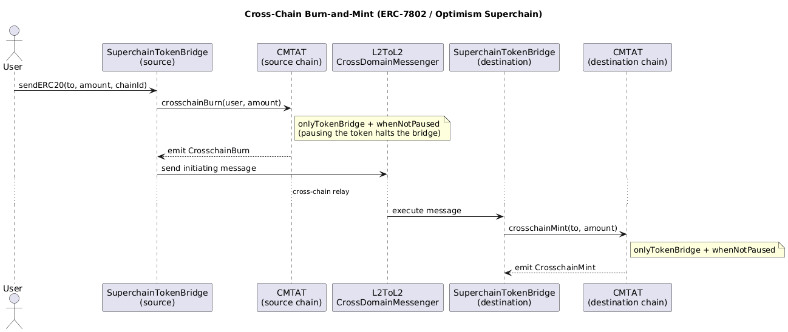

# Cross-Chain Bridge Integration

CMTAT supports cross-chain token transfers through three mechanisms:

| Mechanism | Standard | Module |
|---|---|---|
| Chainlink CCIP | [Cross-Chain Token (CCT)](https://docs.chain.link/ccip/concepts/cross-chain-token) | `CCIPModule` + `ERC20CrossChain` |
| Optimism Superchain | [ERC-7802](https://eips.ethereum.org/EIPS/eip-7802) | `ERC20CrossChain` |
| LayerZero | OFT adapter | External adapter (see [CMTAT-LayerZero](https://github.com/CMTA/CMTAT-LayerZero)) |

## Chainlink CCIP (Cross-Chain Token Standard)

CMTAT implements the [Cross-Chain Token Standard (CCT)](https://docs.chain.link/ccip/concepts/cross-chain-token/evm/tokens#overview), enabling self-service registration with Chainlink CCIP without needing Chainlink's assistance.

### Registration

CMTAT exposes `getCCIPAdmin()` (recommended over `owner()` by CCIP documentation) to return the address authorized to register the token.

```solidity
// CCIPModule
function getCCIPAdmin() public view virtual returns (address)
function setCCIPAdmin(address newAdmin) public virtual  // DEFAULT_ADMIN_ROLE
```

### Transfer Functions (Burn and Mint)

| Function | Module | Role |
|---|---|---|
| `mint(address, uint256)` | `ERC20MintModule` | `MINTER_ROLE` |
| `burn(uint256)` | `ERC20CrossChain` | `BURNER_SELF_ROLE` |
| `burnFrom(address, uint256)` | `ERC20CrossChain` | `BURNER_FROM_ROLE` |
| `decimals()` | `ERC20BaseModule` | - |
| `balanceOf(address)` | OpenZeppelin ERC20 | - |

The CCIP pool must be granted the required `MINTER_ROLE` and `BURNER_FROM_ROLE` (or `BURNER_SELF_ROLE`) to operate.

**Note**: Pausing the contract via `PauseModule` does **not** block `MintModule.mint()`, so CCIP minting still works while paused. However, `burnFrom`, `crosschainMint`, and `crosschainBurn` all have `whenNotPaused` checks and are blocked while paused. To block minting during a pause, revoke `MINTER_ROLE` from the CCIP pool.  
Freezing the pool's address with `setAddressFrozen` does **not** block its `mint` / `crosschainMint`: CMTAT's own freeze logic checks the *recipient*, not the operator, so a frozen minter can still mint. On a RuleEngine deployment (e.g. Standard) the operator is forwarded to the configured RuleEngine as the `spender` argument of `transferred(...)`, so a RuleEngine *rule* may reject the mint on that basis — but the base contract does not, and the Light variant has no RuleEngine. To stop a compromised pool from minting, **revoke its `MINTER_ROLE`**. See [access-control.md](./access-control.md#what-freeze-and-pause-block-per-operation).

#### Why the cross-chain path is pause-gated (but issuer mint/burn is not)

This difference is intentional and is a **security** control, not an oversight of the pause model.

- Standard `mint`/`burn` (`MINTER_ROLE` / `BURNER_ROLE`) are executed by the **issuer or an address in the issuer's own ecosystem**, an actor the issuer trusts. Keeping them available while paused lets the issuer carry out issuance, redemption, and other corporate actions during a transfer halt (see [lifecycle.md](./lifecycle.md)).
- `crosschainMint` / `crosschainBurn` / `burnFrom` / self-`burn`, by contrast, are (or can be) triggered by a **third party** — a cross-chain bridge or pool contract (Chainlink CCIP, the Optimism `SuperchainTokenBridge`, a LayerZero adapter) — that sits **outside** the issuer's direct control. Because a bridge can be compromised, misconfigured, or the source of unexpected cross-chain activity, these paths carry `whenNotPaused` so that pausing the token immediately **stops the bridge from minting or burning**. This bounds the blast radius of a faulty or malicious bridge: `pause()` becomes a single, issuer-held kill-switch over every third-party cross-chain mint/burn, while trusted issuer operations keep running.

In short: the pause is applied to the cross-chain burn and mint operations precisely *because* those functions are not necessarily called by the issuer or an address in the issuer's ecosystem, but by a third-party bridge.

`Lock and Mint` / `Burn and Unlock` models are also compatible through the `Burn and Mint` requirement set. `Lock and Unlock` needs no special token contract support.

### Example

[CMTAT-CCIP](https://github.com/CMTA/CMTAT-CCIP) provides Foundry deployment scripts for CMTAT v3.1.0 with CCIP contracts, built by [Nox Labs](https://github.com/Nox-Labs) in collaboration with CMTA and [Taurus](https://www.taurushq.com).

## Optimism Superchain (ERC-7802)

CMTAT implements [ERC-7802](https://eips.ethereum.org/EIPS/eip-7802) in `ERC20CrossChain`, enabling asset interoperability within the Optimism Superchain by burning on the source chain and minting on the destination chain.

Reference: [docs.optimism.io/interop/superchain-erc20](https://docs.optimism.io/interop/superchain-erc20)



### Source Chain Flow

1. User calls [`SuperchainTokenBridge.sendERC20`](https://github.com/ethereum-optimism/optimism/blob/develop/packages/contracts-bedrock/src/L2/SuperchainTokenBridge.sol#L52-L78).
2. The bridge calls `CMTAT.crosschainBurn` to burn tokens.
3. The bridge emits an initiating message via `L2ToL2CrossDomainMessenger`.

### Destination Chain Flow

1. An autorelayer (or any off-chain entity) sends an executing message to `L2ToL2CrossDomainMessenger`.
2. The destination bridge calls `CMTAT.crosschainMint` to mint tokens for the recipient.

### Requirements

- Grant the `SuperchainTokenBridge` permission to call `crosschainMint` and `crosschainBurn` (`CROSS_CHAIN_ROLE`).
- Deploy CMTAT at the **same address** on every Superchain network where the token should be available.

## LayerZero

Two OFT adapters (ERC-3643 and ERC-7802 variants) are available at [CMTAT-LayerZero](https://github.com/CMTA/CMTAT-LayerZero), built by [Nox Labs](https://github.com/Nox-Labs) in collaboration with CMTA and [Taurus](https://www.taurushq.com).

CMTAT provides two burn/mint interfaces for adapters to use:

- **Standard burn/mint** — same interface as ERC-3643 (`burn(address, uint256)` / `mint(address, uint256)`)
- **Cross-chain burn/mint** — ERC-7802 (`crosschainBurn` / `crosschainMint`)

Choose the adapter that matches the interface used by the LayerZero pool.

## Access Control Summary

| Function | Role | Notes |
|---|---|---|
| `crosschainMint(address, uint256)` | `CROSS_CHAIN_ROLE` | Grant to bridge/pool contract |
| `crosschainBurn(address, uint256)` | `CROSS_CHAIN_ROLE` | Grant to bridge/pool contract |
| `burnFrom(address, uint256)` | `BURNER_FROM_ROLE` | Grant to CCIP pool |
| `burn(uint256)` | `BURNER_SELF_ROLE` | Grant to CCIP pool |
| `mint(address, uint256)` | `MINTER_ROLE` | Grant to CCIP pool |
| `setCCIPAdmin(address)` | `DEFAULT_ADMIN_ROLE` | Manage CCIP registration |

### The bridge gate uses `msg.sender`, not `_msgSender()`

`crosschainMint` and `crosschainBurn` are guarded by the `onlyTokenBridge` modifier, which authorizes the **raw `msg.sender`** — deliberately, and unlike every other role gate in CMTAT, which resolves the caller through `_msgSender()` (ERC-2771 aware). CMTAT follows OpenZeppelin's `draft-ERC20Bridgeable` here: a token bridge holds an unbounded mint authority, so it must never be impersonable through a relayer.

Two consequences for integrators:

- **A bridge cannot relay its calls through the ERC-2771 forwarder.** It must call `crosschainMint` / `crosschainBurn` **directly**, as `msg.sender`. A meta-transaction relayed by the forwarder reverts, because the forwarder — not the bridge — is the raw caller and does not hold `CROSS_CHAIN_ROLE`.
- **Never grant `CROSS_CHAIN_ROLE` to the ERC-2771 forwarder.** This is the tempting "fix" for the point above, and it is a critical misconfiguration: granting it would make **every relayed call pass the gate**, since `onlyTokenBridge` only ever inspects the raw caller. Any user could then submit a meta-transaction through the forwarder and mint an arbitrary amount to any address — the token's supply control would be gone. The forwarder is set at construction and is irrevocable in standalone deployments, so this cannot be undone by re-pointing it; the only remedy is revoking the role.

> The same reasoning applies to any contract that can be made to call the token on a third party's behalf: `CROSS_CHAIN_ROLE` must be held only by contracts whose call to `crosschainMint` / `crosschainBurn` is itself the authorization decision.

Reported as NM-4 by [Nethermind AuditAgent](https://auditagent.nethermind.io/) on CMTAT v3.3.0-rc2 and assessed as intended behaviour with a deployment constraint; see the [maintainer feedback](../security/tools/nethermind-audit-agent/v3.3.0-rc2/audit_agent_report_v3.3.0-rc2-feedback.md).

## RuleEngine Operator Semantics

- `burnFrom` uses allowance and now propagates `_msgSender()` into the compliance hook, so spender-aware RuleEngine checks are applied.
- `crosschainBurn` also propagates `_msgSender()` to keep operator semantics consistent with `burnFrom`.
- `crosschainMint` now also propagates `_msgSender()` to enable spender-aware RuleEngine checks for bridge-initiated mint flows.

`burnFrom` is role-gated (`BURNER_FROM_ROLE`) and is not treated as a classic `transferFrom` policy path. In RuleEngine hook calls, `burn` and `burnFrom` both map to burn semantics (`to == address(0)`) and cannot be differentiated from hook parameters alone. To apply controls specific to `burnFrom`, define RuleEngine rules on the operator addresses that are authorized to execute `burnFrom`.

If a RuleEngine restriction should apply only to classic `transferFrom` spender behavior, add guards to exclude mint/burn operator flows:
- require `from != address(0)` to exclude mint paths,
- require `to != address(0)` to exclude burn paths.
