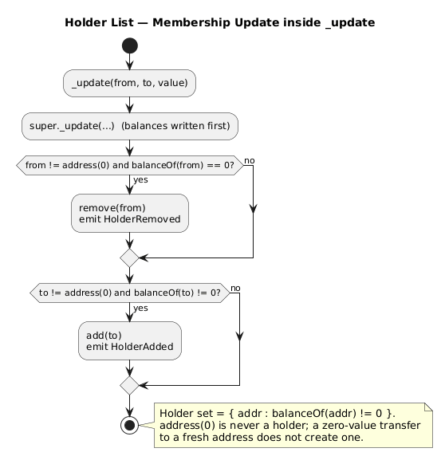

# Holder List

The **HolderList** module maintains, on-chain, the set of addresses that currently hold a non-zero balance, with paginated reads. It is an optional module (`HolderListModule`) exposed on the dedicated `CMTATBaseHolderList` base and its deployment variants.

The holder set is a pure **view over `balanceOf`**: an address belongs to it **if and only if** its balance is non-zero. There is no separate accounting to keep in sync beyond the balances themselves.

## How It Works

The set is updated inside the ERC-20 `_update` hook, **after** balances have been written, so the post-update balance decides membership:

```solidity
function _update(address from, address to, uint256 value) internal override {
    super._update(from, to, value);              // balances updated first
    if (from != address(0) && balanceOf(from) == 0) remove(from);  // emits HolderRemoved
    if (to   != address(0) && balanceOf(to)   != 0) add(to);       // emits HolderAdded
}
```



Because it hooks `_update`, **every** balance change is covered: `transfer`, `transferFrom`, `mint`, `burn`, forced transfer/burn, and cross-chain mint/burn. Two invariants follow directly:

- `address(0)` (the mint source and burn sink) is **never** a holder.
- A **zero-value** transfer to a fresh address does **not** create a holder (its balance stays zero).

The set is backed by an OpenZeppelin `EnumerableSet.AddressSet` in its own ERC-7201 storage slot (`CMTAT.storage.HolderListModule`).

## Interface

```solidity
interface IHolderListModule {
    event HolderAdded(address indexed holder);
    event HolderRemoved(address indexed holder);

    error CMTAT_HolderListModule_IndexOutOfBounds(uint256 index, uint256 holderCount);
    error CMTAT_HolderListModule_InvalidRange(uint256 fromIndex, uint256 toIndex);

    function holderCount() external view returns (uint256);
    function isHolder(address account) external view returns (bool);
    function holderByIndex(uint256 index) external view returns (address);
    function holders() external view returns (address[] memory);
    function holdersInRange(uint256 fromIndex, uint256 toIndex) external view returns (address[] memory window);
}
```

The names follow the fungible holder-enumeration specification. **All reads are unrestricted** (no role): the holder set is derivable from the transfer log anyway.

| Function | Meaning |
|---|---|
| `holderCount()` | Number of addresses currently holding a non-zero balance. |
| `isHolder(account)` | `true` iff `account`'s balance is non-zero. |
| `holderByIndex(index)` | Holder at `index`; reverts `CMTAT_HolderListModule_IndexOutOfBounds` if `index >= holderCount()`. |
| `holders()` | The whole list in one call. **Unbounded** — see below. |
| `holdersInRange(fromIndex, toIndex)` | The half-open window `[fromIndex, toIndex)`; length is exactly `toIndex - fromIndex`. |

## Pagination

`holdersInRange` is half-open (`fromIndex` inclusive, `toIndex` exclusive) and is a slice of the same sequence `holderByIndex` enumerates: `holdersInRange(f, t)[i] == holderByIndex(f + i)` within a single block, and `holders()` equals `holdersInRange(0, holderCount())`.

Revert rules:

- `fromIndex > toIndex` → `CMTAT_HolderListModule_InvalidRange` (the malformed-range check runs **first**, so an inverted range always yields this error regardless of the bounds).
- `toIndex > holderCount()` → `CMTAT_HolderListModule_IndexOutOfBounds`.
- `fromIndex == toIndex` returns an **empty** array without reverting — including when both equal `holderCount()`, the natural terminating condition of a paging loop.

## ERC-165

`CMTATBaseHolderList.supportsInterface` returns `true` for `type(IHolderListModule).interfaceId`, so the holder-list capability is discoverable on-chain.

## Deployment

`CMTATBaseHolderList` (**level 8**, `contracts/modules/8_CMTATBaseHolderList.sol`) is the CMTAT standard module set plus `HolderListModule`. Two deployment variants expose it, with the same constructor / `initialize` signatures as the standard variants:

| Deployment variant | Base |
|---|---|
| `CMTATStandaloneHolderList` | `CMTATBaseHolderList` (level 8) |
| `CMTATUpgradeableHolderList` | `CMTATBaseHolderList` (level 8) |

`HolderListModule` inherits `ERC20Upgradeable`, so `CMTATBaseHolderList` disambiguates the ERC-20 entry points: all of them resolve to `CMTATBaseERC7551Enforcement` (keeping the standard validation), and only `_update` resolves to `HolderListModule` (which calls `super._update`, still reaching `ERC20Upgradeable-_update`).

## Gas

The first transfer crediting a **new** address writes two storage slots (the `EnumerableSet` stores the value and its index); the transfer that empties an account clears them. Transfers between existing holders that leave both balances non-zero cost nothing extra for this module.

## Security Considerations

- **Unbounded growth / dusting DoS on `holders()`.** On a token whose transfers are not gated by an allowlist or a rule engine, anyone can inflate `holderCount()` by dusting fresh addresses; the spammer pays the two storage writes, but `holders()` eventually runs out of gas and becomes unusable. `holders()` is an **off-chain (`eth_call`) getter**: on-chain callers, and any caller that cannot bound the holder count, MUST use `holdersInRange(fromIndex, toIndex)` with a bounded window. Deployments expecting a large or adversarial holder set should pair the module with an allowlist.
- **Windows are not a consistent snapshot.** The underlying `EnumerableSet` is unordered and a removal moves the last holder into the freed slot, so `holderByIndex`/`holdersInRange` results read across several blocks may miss a holder or return one twice. Read the whole set at a fixed block (`eth_call` at a block number) if a consistent view is required.

## Use Case

The on-chain holder set supports issuer reporting and corporate actions (e.g. enumerating shareholders for a distribution or a vote) without reconstructing the list from the full transfer history off-chain. For dividend-style *balance-at-a-block* queries, use the [Snapshot Engine](./snapshot.md) instead — the holder list tracks *current* membership, not historical balances.
