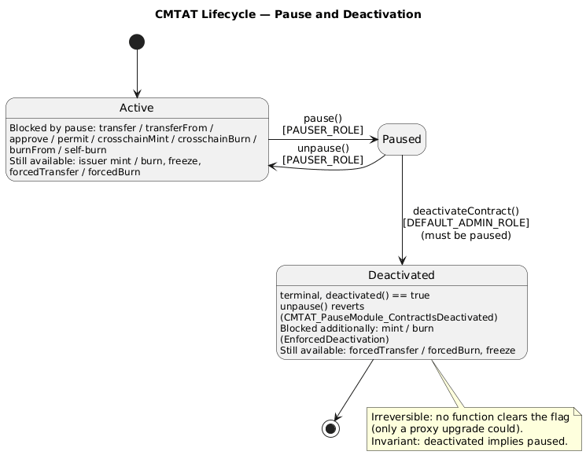

# Smart Contract Lifecycle: Pause and Deactivation

CMTAT has two lifecycle controls, implemented in `PauseModule`:

- **Pause** — a *reversible* halt of holder transferability, for temporary incidents.
- **Deactivation** — an *irreversible*, terminal stop, for end-of-life events (legal migration, corporate actions that cancel or immobilise all tokens). Proposed as [ERC-8343](../ERCSpecification/draft-erc-8343-deactivation.md) — a **draft, not yet merged** ([PR #1900](https://github.com/ethereum/ERCs/pull/1900)).

```
   active  ──pause()──►  paused  ──deactivateContract()──►  deactivated
     ▲                     │                                 (terminal)
     └──── unpause() ──────┘                                 unpause() reverts
```



Deactivation is built on top of pause: a contract **must be paused before it can be deactivated**, and once deactivated it **cannot be unpaused**. So `deactivated` is a *permanent, terminal pause*.

## Pause

| | |
|---|---|
| Interface | `IERC3643Pause` / `IERC7551Pause` |
| Role | `PAUSER_ROLE` (`pause`, `unpause`) |
| Functions | `pause()`, `unpause()`, `paused()` |
| Event | `Paused(account)` / `Unpaused(account)` (OpenZeppelin `Pausable`) |

`pause()` sets the paused flag; `unpause()` clears it (unless the contract is deactivated — see below). Pause is fully reversible.

## Deactivation (ERC-8343)

| | |
|---|---|
| Interface | `IERC8343` (`contracts/interfaces/tokenization/draft-IERC8343.sol`), formerly `ICMTATDeactivate` |
| Standard status | **Draft — not yet merged** ([ERC-8343, PR #1900](https://github.com/ethereum/ERCs/pull/1900)) |
| ERC-165 id | `0xe9cd80b0` (advertised by `supportsInterface`) |
| Role | `DEFAULT_ADMIN_ROLE` |
| Functions | `deactivateContract()`, `deactivated()` |
| Event | `Deactivated(address indexed account)` |
| Errors | `AlreadyDeactivated()`, `EnforcedDeactivation()`, `CMTAT_PauseModule_ContractIsDeactivated()` |

```solidity
interface IERC8343 {
    event Deactivated(address indexed account);
    error AlreadyDeactivated();
    function deactivateContract() external;
    function deactivated() external view returns (bool isDeactivated);
}
```

`deactivateContract()`:

1. requires the caller to hold `DEFAULT_ADMIN_ROLE`;
2. requires the contract to be **paused** (`PausableUpgradeable._requirePaused()`), otherwise reverts;
3. reverts with `AlreadyDeactivated()` if it has already been deactivated;
4. sets the deactivation flag and emits `Deactivated(msg.sender)`.

`deactivated()` is a non-reverting view returning the terminal status.

**Irreversibility.** No function sets the flag back to `false`. Deactivation is permanent for a given implementation. With an upgradeable proxy an issuer can technically roll it back only by deploying a new implementation that clears the flag — integrators should treat `deactivated() == true` as terminal unless governance explicitly states otherwise.

**The `deactivated ⇒ paused` invariant** is enforced from both sides:
- `deactivateContract()` requires the paused state (step 2 above);
- `unpause()` reverts with `CMTAT_PauseModule_ContractIsDeactivated()` while deactivated.

## What each state blocks

Pause and deactivation gate operations at **different** layers, so they do not block the same set of functions. This table reflects the actual enforcement points in the code.

| Operation | Blocked by **Pause** | Blocked by **Deactivation** |
|---|---|---|
| `transfer` / `transferFrom` (holders) | ✓ `EnforcedPause` | ✓ (via the `deactivated ⇒ paused` invariant) |
| `approve` | ✓ `EnforcedPause` | ✓ (via pause) |
| `mint` / `burn` (`MINTER_ROLE` / `BURNER_ROLE`) | ✗ **not** blocked by pause alone | ✓ `EnforcedDeactivation` |
| `crosschainMint` / `crosschainBurn` / `burnFrom` / self-`burn` | ✓ `EnforcedPause` | ✓ |
| `unpause()` | — | ✓ `CMTAT_PauseModule_ContractIsDeactivated` |
| `forcedTransfer` / `forcedBurn` (`DEFAULT_ADMIN_ROLE`) | ✗ | ✗ **remains available** |
| Freeze/unfreeze, role admin, document/terms updates, `deactivateContract` | ✗ | ✗ |

Two points deserve emphasis:

- **Pause targets holder transferability and bridging, not issuance.** Standard `mint`/`burn` are role-gated (`MINTER_ROLE`/`BURNER_ROLE`) and are validated only against **deactivation** and freeze status — they are **not** stopped by pause alone. To fully stop issuance, deactivate (or revoke the mint/burn roles). Cross-chain issuance *is* pause-gated (`crosschainMint`/`crosschainBurn`/`burnFrom`/self-`burn` carry `whenNotPaused`). This asymmetry is deliberate and **security-driven**: the cross-chain paths are triggered by a **third-party bridge** rather than by the issuer or an address in the issuer's ecosystem, so gating them on pause gives the issuer a single kill-switch over a compromised or misbehaving bridge, while trusted issuer `mint`/`burn` stay available for corporate actions during a pause. See [cross-chain-bridge-integration.md](./cross-chain-bridge-integration.md#why-the-cross-chain-path-is-pause-gated-but-issuer-mintburn-is-not).
- **`forcedTransfer` / `forcedBurn` bypass both pause and deactivation.** They move tokens through the ERC-20 `_update` primitive directly, without the pause/deactivation validation used by holder transfers. This is intentional: they are the enforcer's emergency/regulatory tool and, per ERC-8343, a named privileged operation that remains available after deactivation (for example to sweep a frozen or migrated position). Any address holding `DEFAULT_ADMIN_ROLE` can therefore still move tokens after deactivation.

## Errors

| Error | Raised when |
|---|---|
| `EnforcedPause()` (OZ `Pausable`) | a holder transfer / `approve` / cross-chain op is attempted while paused |
| `EnforcedDeactivation()` | `mint` / `burn` is attempted while deactivated |
| `AlreadyDeactivated()` | `deactivateContract()` is called a second time |
| `CMTAT_PauseModule_ContractIsDeactivated()` | `unpause()` is called while deactivated |

## Access control

`pause`/`unpause` require `PAUSER_ROLE`; `deactivateContract` requires `DEFAULT_ADMIN_ROLE`. See [access-control.md](./access-control.md).

## Security Considerations

- **Deactivation is irreversible** on an immutable deployment. Confirm the paused state and the intent before calling `deactivateContract()`; there is no undo other than a proxy upgrade.
-  **`DEFAULT_ADMIN_ROLE` is powerful.** It can deactivate the contract (a permanent denial of holder transfers) and, because `forcedTransfer`/`forcedBurn` survive deactivation, can still move tokens afterwards. Protect this key with a multisig or timelock, and note the extra exposure on the UUPS variant (admin and upgrade authority are not segregated).
- ℹ**Pause is a transfer-level control, not a full freeze of the contract.** Issuers who need to stop *all* activity (including minting) must deactivate or manage the mint/burn roles accordingly.
- **Off-chain interpretation.** Treat `Deactivated` as a terminal lifecycle event for public holder operations, not as a guarantee that no privileged operation can ever execute (forced transfers and admin actions can). For upgradeable deployments, default to "once deactivated, permanently deactivated" unless governance documentation says otherwise.
