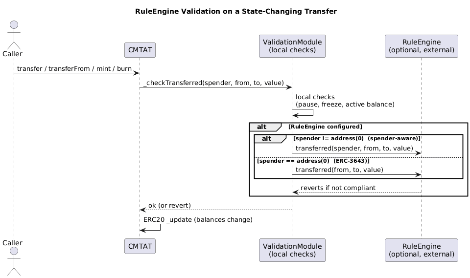

# RuleEngine Integration In CMTAT

## Scope

This document explains how CMTAT integrates an external RuleEngine, including:
- interface requirements,
- execution hooks and call paths,
- operator/spender semantics,
- deployment coverage and constraints,
- implementation guidance for RuleEngine authors.

## Core Contracts And Interfaces

- RuleEngine interfaces:
  - [IRuleEngine.sol](/home/ryan/Pictures/dev/CMTAT/contracts/interfaces/engine/IRuleEngine.sol)
- RuleEngine storage wiring:
  - `ValidationModuleRuleEngineInternal` (engine slot + setter/getter)
- RuleEngine extension wrapper:
  - [ValidationModuleRuleEngine.sol](/home/ryan/Pictures/dev/CMTAT/contracts/modules/wrapper/extensions/ValidationModule/ValidationModuleRuleEngine.sol)
- Base integration point:
  - [3_CMTATBaseRuleEngine.sol](/home/ryan/Pictures/dev/CMTAT/contracts/modules/3_CMTATBaseRuleEngine.sol)
- Generic validation flow:
  - [ValidationModule.sol](/home/ryan/Pictures/dev/CMTAT/contracts/modules/wrapper/controllers/ValidationModule.sol)
  - [ValidationModuleCore.sol](/home/ryan/Pictures/dev/CMTAT/contracts/modules/wrapper/core/ValidationModuleCore.sol)

## Interface Requirements

Minimum RuleEngine target interface in CMTAT:

1. `IRuleEngine`:
- `transferred(address from, address to, uint256 value)` (ERC-3643-style)
- `transferred(address spender, address from, address to, uint256 value)` (spender-aware extension)
- `canTransfer(from, to, value)` (read-only pre-check)
- `canTransferFrom(spender, from, to, value)` (spender-aware pre-check)

2. Optional `IRuleEngineERC1404` (if ERC-1404-specific behavior is needed):
- adds `detectTransferRestriction*` and `messageForTransferRestriction`.

> **ERC-1404 — two versions, both supported.** CMTAT (and the RuleEngine mock) implement **both** ERC-1404 variants:
> - the **original** ERC-1404, which was only ever published as a [GitHub issue](https://github.com/ethereum/EIPs/issues/1404) and never became a merged EIP — covered by `IERC1404` (`detectTransferRestriction(from, to, value)` + `messageForTransferRestriction(code)`);
> - its **current rework**, the draft proposal ["Simple Restricted Token" (ethereum/ERCs PR #1701)](https://github.com/ethereum/ERCs/pull/1701), still **open/draft**, which brings ERC-1404 into the canonical format — covered by `IERC1404Extend`, adding the spender-aware `detectTransferRestrictionFrom(spender, from, to, value)` that pairs with CMTAT's `canTransferFrom` / spender-aware paths.

> **Scope — transfers only.** Both `detectTransferRestriction*` methods describe `transfer` /
> `transferFrom`. CMTAT does **not** support the rework draft's `address(0)` encoding for mint/burn
> prediction, because its pause rule differs *between entry points of the same operation*
> (`MINTER_ROLE` mint and `BURNER_ROLE` burn proceed while paused; `crosschainMint`,
> `crosschainBurn`, `burnFrom` and `burn(uint256)` do not), and the ERC-1404 signature carries no
> entry-point discriminator. Use `canTransfer` / `canTransferFrom` for mint and burn prediction. See
> the [ERC-1404 scope note](../README.md#scope-transfers-only-never-mint-or-burn).
>
> A RuleEngine still receives mint/burn notifications through `transferred(...)` with the
> `address(0)` encoding — that is the *enforcement* path and is unaffected by the above. What is
> not supported is *predicting* a mint or burn through the ERC-1404 read methods.

## Configuration Lifecycle

RuleEngine is optional and can be zero-address.

- Set/update entrypoint:
  - `setRuleEngine(IRuleEngine)` in `ValidationModuleRuleEngine`.
- Access control:
  - gated by `_authorizeRuleEngineManagement`.
  - in CMTAT base integration, this is restricted to `DEFAULT_ADMIN_ROLE`.
- Same-value protection:
  - reverts with `CMTAT_ValidationModule_SameValue()`.

## Runtime Call Flow

### A) Read-only checks

1. Public check (`canTransfer`, `canTransferFrom`) enters `ValidationModuleRuleEngine`.
2. Local CMTAT checks run first (pause/freeze/allowance and active-balance checks in base chain).
3. If a RuleEngine is configured, CMTAT calls:
- `ruleEngine.canTransfer(...)`, or
- `ruleEngine.canTransferFrom(...)`.
4. If no RuleEngine is configured, RuleEngine layer returns `true`.

Important:
- `canTransfer(from, to, value)` does not include a spender/operator argument, so it cannot enforce spender/operator-specific policies.
- Use `canTransferFrom(spender, from, to, value)` when the policy must validate a delegated caller/operator.

### B) State-changing token operations

For transfer/mint/burn and related flows, CMTAT ultimately calls `_checkTransferred(...)`.

In RuleEngine-enabled base chains (`CMTATBaseRuleEngine`), `_checkTransferred` extends common checks and then calls:
- `ValidationModuleRuleEngine._transferred(spender, from, to, value)`.

Inside `_transferred`:
- local generic checks are executed first (`_canTransferGenericByModuleAndRevert`),
- then RuleEngine hook is called if configured:
  - spender-aware hook if `spender != address(0)`,
  - ERC-3643 3-arg hook if `spender == address(0)`.

RuleEngine is expected to revert if transfer is invalid.

## Spender / Operator Semantics

CMTAT uses spender-aware semantics beyond classic `transferFrom`:

1. Classic delegated transfer:
- `transferFrom`: `spender` is delegated caller.

2. Mint / burn operator flows:
- mint-like paths: `from == address(0)`, `spender == operator`.
- burn-like paths: `to == address(0)`, `spender == operator`.

3. Cross-chain operator flows:
- `crosschainBurn` / `crosschainMint` propagate operator context for spender-aware RuleEngine logic.

4. Minter transfer path:
- ERC-3643 `batchTransfer` minter path propagates `_msgSender()` as `spender`.
- This is a transfer path (`from != address(0)`), not mint classification.

Practical implication:
- if a RuleEngine rule should apply only to classic `transferFrom`, it must explicitly exclude mint/burn operator tuples.

## Deployment Coverage

RuleEngine support depends on deployment inheritance:

- RuleEngine-capable variants include chains inheriting `CMTATBaseRuleEngine` (directly or indirectly through higher-level bases).
- Variants based on allowlist-only paths without RuleEngine module do not expose runtime RuleEngine configuration.
- Light variant is intentionally reduced and does not provide full RuleEngine feature surface.

Use deployment summary in [doc/SUMMARY.md](../SUMMARY.md) and deployment tables in [doc/README.md](../README.md) to select the correct variant.

## Authoring Guidelines For RuleEngine Implementers

1. Restrict `transferred(...)` to authorized token contracts.
2. Keep `canTransfer*` and `transferred*` policy-consistent (read-check and state-hook should not diverge unexpectedly).
3. Handle spender/operator tuples explicitly:
- classic delegated transfer,
- operator mint,
- operator burn,
- cross-chain/operator-driven paths.
4. Do not rely only on `from == address(0)`/`to == address(0)` unless policy intentionally treats operator mint/burn uniformly.
5. If targeting ERC-1404 UX, implement `IRuleEngineERC1404` functions consistently with `canTransfer*`.

## Known Design Choices

1. RuleEngine address is not contract-type enforced at set-time by default (design choice).
2. Read-only pre-checks are advisory; runtime may still revert on later checks/state changes.
3. RuleEngine is optional; base validation still applies even when RuleEngine is unset.

## Cross-References

- Main RuleEngine section: [doc/README.md](../README.md)
- ERC-7943 integration: [erc-7943-uRWA-integration.md](./erc-7943-uRWA-integration.md)
- ERC-3643 mapping: [erc-3643-implementation.md](./erc-3643-implementation.md)
