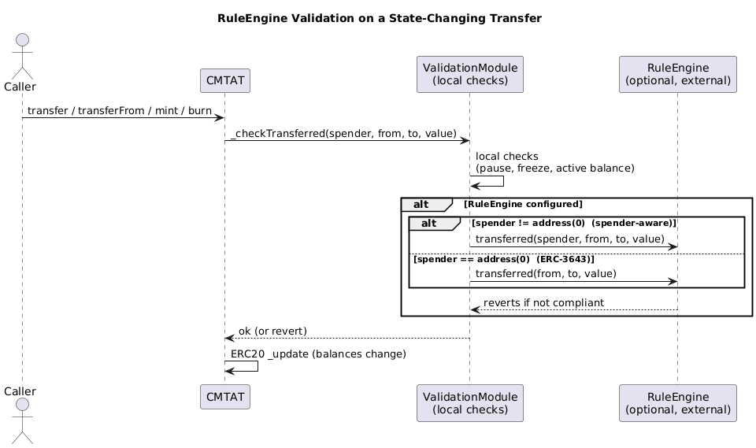

# RuleEngine Integration In CMTAT

## Scope

This document explains how CMTAT integrates an external RuleEngine, including:
- interface requirements,
- execution hooks and call paths,
- operator/spender semantics,
- deployment coverage and constraints,
- implementation guidance for RuleEngine authors.

## Core Contracts And Interfaces

- RuleEngine interfaces:
  - [IRuleEngine.sol](../../contracts/interfaces/engine/IRuleEngine.sol)
- RuleEngine storage wiring:
  - `ValidationModuleRuleEngineInternal` (engine slot + setter/getter)
- RuleEngine extension wrapper:
  - [ValidationModuleRuleEngine.sol](../../contracts/modules/wrapper/extensions/ValidationModule/ValidationModuleRuleEngine.sol)
- Base integration point:
  - [3_CMTATBaseRuleEngine.sol](../../contracts/modules/3_CMTATBaseRuleEngine.sol)
- Generic validation flow:
  - [ValidationModule.sol](../../contracts/modules/wrapper/controllers/ValidationModule.sol)
  - [ValidationModuleCore.sol](../../contracts/modules/wrapper/core/ValidationModuleCore.sol)

## Interface Requirements

Minimum RuleEngine target interface in CMTAT:

1. `IRuleEngine`:
- `transferred(address from, address to, uint256 value)` (ERC-3643-style)
- `transferred(address spender, address from, address to, uint256 value)` (spender-aware extension)
- `canTransfer(from, to, value)` (read-only pre-check)
- `canTransferFrom(spender, from, to, value)` (spender-aware pre-check)

2. Optional `IRuleEngineERC1404` (if ERC-1404-specific behavior is needed):
- adds `detectTransferRestriction*` and `messageForTransferRestriction`.

> **ERC-1404 — two versions, both supported.** CMTAT (and the RuleEngine mock) implement **both** ERC-1404 variants:
> - the **original** ERC-1404, which was only ever published as a [GitHub issue](https://github.com/ethereum/EIPs/issues/1404) and never became a merged EIP — covered by `IERC1404` (`detectTransferRestriction(from, to, value)` + `messageForTransferRestriction(code)`);
> - its **current rework**, the draft proposal ["Simple Restricted Token" (ethereum/ERCs PR #1701)](https://github.com/ethereum/ERCs/pull/1701), still **open/draft**, which brings ERC-1404 into the canonical format — covered by `IERC1404Extend`, adding the spender-aware `detectTransferRestrictionFrom(spender, from, to, value)` that pairs with CMTAT's `canTransferFrom` / spender-aware paths.

> **Scope — transfers only.** Both `detectTransferRestriction*` methods describe `transfer` /
> `transferFrom`. CMTAT does **not** support the rework draft's `address(0)` encoding for mint/burn
> prediction, because its pause rule differs *between entry points of the same operation*
> (`MINTER_ROLE` mint and `BURNER_ROLE` burn proceed while paused; `crosschainMint`,
> `crosschainBurn`, `burnFrom` and `burn(uint256)` do not), and the ERC-1404 signature carries no
> entry-point discriminator. Use `canTransfer` / `canTransferFrom` for mint and burn prediction. See
> the [ERC-1404 scope note](../README.md#scope-transfers-only-never-mint-or-burn).
>
> A RuleEngine still receives mint/burn notifications through `transferred(...)` with the
> `address(0)` encoding — that is the *enforcement* path and is unaffected by the above. What is
> not supported is *predicting* a mint or burn through the ERC-1404 read methods.

## Configuration Lifecycle

RuleEngine is optional and can be zero-address.

- Set/update entrypoint:
  - `setRuleEngine(IRuleEngine)` in `ValidationModuleRuleEngine`.
- Access control:
  - gated by `_authorizeRuleEngineManagement`.
  - in CMTAT base integration, this is restricted to `DEFAULT_ADMIN_ROLE`.
- Same-value protection:
  - reverts with `CMTAT_ValidationModule_SameValue()`.

## Runtime Call Flow

### A) Read-only checks

1. Public check (`canTransfer`, `canTransferFrom`) enters `ValidationModuleRuleEngine`.
2. Local CMTAT checks run first (pause/freeze/allowance and active-balance checks in base chain).
3. If a RuleEngine is configured, CMTAT calls:
- `ruleEngine.canTransfer(...)`, or
- `ruleEngine.canTransferFrom(...)`.
4. If no RuleEngine is configured, RuleEngine layer returns `true`.

Important:
- `canTransfer(from, to, value)` does not include a spender/operator argument, so it cannot enforce spender/operator-specific policies.
- Use `canTransferFrom(spender, from, to, value)` when the policy must validate a delegated caller/operator.

### B) State-changing token operations

For transfer/mint/burn and related flows, CMTAT ultimately calls `_checkTransferred(...)`.

In RuleEngine-enabled base chains (`CMTATBaseRuleEngine`), `_checkTransferred` extends common checks and then calls:
- `ValidationModuleRuleEngine._transferred(spender, from, to, value)`.

Inside `_transferred`:
- local generic checks are executed first (`_canTransferGenericByModuleAndRevert`),
- then RuleEngine hook is called if configured:
  - spender-aware hook if `spender != address(0)`,
  - ERC-3643 3-arg hook if `spender == address(0)`.

RuleEngine is expected to revert if transfer is invalid.

## Spender / Operator Semantics

CMTAT uses spender-aware semantics beyond classic `transferFrom`:

1. Classic delegated transfer:
- `transferFrom`: `spender` is delegated caller.

2. Mint / burn operator flows:
- mint-like paths: `from == address(0)`, `spender == operator`.
- burn-like paths: `to == address(0)`, `spender == operator`.

3. Cross-chain operator flows:
- `crosschainBurn` / `crosschainMint` propagate operator context for spender-aware RuleEngine logic.

4. Minter transfer path:
- ERC-3643 `batchTransfer` minter path propagates `_msgSender()` as `spender`.
- This is a transfer path (`from != address(0)`), not mint classification.

Practical implication:
- if a RuleEngine rule should apply only to classic `transferFrom`, it must explicitly exclude mint/burn operator tuples.

## Deployment Coverage

RuleEngine support depends on deployment inheritance:

- RuleEngine-capable variants include chains inheriting `CMTATBaseRuleEngine` (directly or indirectly through higher-level bases).
- Variants based on allowlist-only paths without RuleEngine module do not expose runtime RuleEngine configuration.
- Light variant is intentionally reduced and does not provide full RuleEngine feature surface.

Use deployment summary in [doc/SUMMARY.md](../SUMMARY.md) and deployment tables in [doc/README.md](../README.md) to select the correct variant.

## Authoring Guidelines For RuleEngine Implementers

1. Restrict `transferred(...)` to authorized token contracts.
2. Keep `canTransfer*` and `transferred*` policy-consistent (read-check and state-hook should not diverge unexpectedly).
3. Handle spender/operator tuples explicitly:
- classic delegated transfer,
- operator mint,
- operator burn,
- cross-chain/operator-driven paths.
4. Do not rely only on `from == address(0)`/`to == address(0)` unless policy intentionally treats operator mint/burn uniformly.
5. If targeting ERC-1404 UX, implement `IRuleEngineERC1404` functions consistently with `canTransfer*`.
6. `messageForTransferRestriction(code)` must return a **non-empty** string for every code the engine can return,
   and that string must never denote the absence of a restriction (`"No restriction"`, `""`, …) for a non-zero
   code. The token resolves its own codes (`0`–`6`) and **forwards every other code to the engine verbatim**, so
   the engine's string is what integrators and user interfaces display. An empty or misleading string therefore
   surfaces a blocked transfer as if it were permitted — see the ERC-1404 rework draft,
   `messageForTransferRestriction`. The token does not inspect the forwarded value: the RuleEngine is
   `DEFAULT_ADMIN_ROLE`-set and trusted, and a length check would guard only the least harmful failure while
   costing bytecode on variants already close to the EIP-170 limit.
7. The engine must implement `IRuleEngineERC1404` if the token exposes ERC-1404. `detectTransferRestriction` /
   `messageForTransferRestriction` on the token forward to the engine unguarded, so an engine without those
   methods makes both token view functions revert (the enforcement path, which calls `transferred(...)`, is
   unaffected). See design choice 1 below: the engine type is not validated at set-time.

## Known Design Choices

1. RuleEngine address is not contract-type enforced at set-time by default (design choice).
2. Read-only pre-checks are advisory; runtime may still revert on later checks/state changes.
3. RuleEngine is optional; base validation still applies even when RuleEngine is unset.
4. The token does not sanitise what the engine returns — neither the restriction code nor the message. Both are
   forwarded as-is, consistent with the trusted-engine assumption stated above and with design choice 1.

## Breaking Changes By Version

This section lists, for each release, the changes that can break an **existing RuleEngine** or the **RuleEngine
configuration of an upgraded proxy**: interface, how the token calls the engine, and where the engine address is
stored. Each release is compared with the previous one in the list. Every item was checked against the code of the
corresponding git tag. Breaking changes that do not involve the RuleEngine are in
[breaking-changes.md](./breaking-changes.md) and the [CHANGELOG](../../CHANGELOG.md).

### Summary

| Release | Interface | Token → engine calls | Engine address storage | Breaking for an existing engine? |
| --- | --- | --- | --- | --- |
| **v2.3.0** (vs v2.2) | `IEIP1404Wrapper` replaces `IRuleEngine` as the engine type | unchanged (`validateTransfer`, `detectTransferRestriction`, `messageForTransferRestriction`) | unchanged (`ruleEngine` state variable) | **Compile time only**; `RuleEngineSet` event renamed `RuleEngine` |
| **v3.0.0** (vs v2.3.0) | new `IRuleEngine` (ERC-3643 + ERC-7551 + ERC-1404 extension) | `transferred(...)` hook replaces `validateTransfer` / `operateOnTransfer`; `canTransfer*` views | new ERC-7201 namespace | **Yes, full rewrite**: a v2.x engine does not work with v3.0.0 |
| **v3.1.0** | unchanged | unchanged | unchanged | **No** |
| **v3.2.0** | `IRuleEngine` drops `IERC1404Extend`, adds `IERC165`; new `IRuleEngineERC1404` | unchanged signatures; the token reverts directly on a local check failure | unchanged | **Compile time**: ERC-165 required, `IRuleEngineERC1404` for ERC-1404 variants |
| **v3.3.0** | unchanged (pragma `^0.8.24`) | supply operations now use the **4-arg** `transferred`; reentrancy guard on 3 variants | unchanged | **Yes, behavioural**: mint / burn dispatch and reentrancy |

### v2.3.0 (compared with v2.2)

- **Interface.** The token types the engine as `IEIP1404Wrapper` (`validateTransfer`, `detectTransferRestriction`,
  `messageForTransferRestriction`) instead of `IRuleEngine`. The rule-management functions of the old `IRuleEngine`
  (`setRules`, `rules`, `rule`, `ruleLength`) are no longer required by the token and moved to the mocks. The
  `IERC1404*` interfaces were renamed `IEIP1404*`.
- **Calls.** Unchanged: `_beforeTokenTransfer` (transfers, mints and burns) requires `validateTransfer(from, to,
  amount)` to return `true`; the ERC-1404 views are forwarded to the engine.
- **Configuration.**
  - `setRuleEngine(IEIP1404Wrapper)` now reverts with `"Same value"` when the address does not change.
  - The event `RuleEngineSet(IRuleEngine)` is renamed `RuleEngine(IEIP1404Wrapper)`. Indexers listening to the old
    event must be updated.
- **Storage.** Unchanged (`ruleEngine` state variable, followed by `__gap`).
- **Impact.** An existing engine keeps working, since the called selectors are unchanged. Only code compiled against
  the CMTAT interfaces, and event consumers, must be updated.

### v3.0.0 (compared with v2.3.0, audited)

The RuleEngine integration was redesigned. The intermediate v2.4.0 and v2.5.x releases already introduced part of it:
v2.4.0 added `operateOnTransfer(from, to, amount) returns (bool)` as a state-changing hook in `_update`, and v2.5.0
moved the engine address to ERC-7201 storage (`CMTAT.storage.ValidationModuleInternal`).

- **Interface.** `IRuleEngine is IERC1404Extend, IERC7551Compliance, IERC3643IComplianceContract`:
  - state hooks: `transferred(from, to, value)` (ERC-3643) and `transferred(spender, from, to, value)`
    (spender-aware). They return nothing and **must revert** to reject an operation;
  - views: `canTransfer(from, to, value)`, `canTransferFrom(spender, from, to, value)`;
  - ERC-1404: `detectTransferRestriction`, `detectTransferRestrictionFrom` (new), `messageForTransferRestriction`.
- **Calls.**
  - `validateTransfer` and `operateOnTransfer` are no longer called.
  - On every transfer, mint and burn the token calls `transferred(...)`: the 4-arg overload when a spender is known
    (`transferFrom`), the 3-arg one otherwise (`transfer`, mint, burn).
- **Storage.** The engine address moved to a new namespace, `CMTAT.storage.ValidationModuleRuleEngine`
  (`0x77c8cc89…`). The v2.x slot is no longer read, and there is no upgrade path from a v2.x proxy.
- **Configuration.** The engine can be passed at deployment (`ICMTATConstructor.Engine.ruleEngine`) or set with
  `setRuleEngine(IRuleEngine)`, which reverts with `CMTAT_ValidationModule_SameValue()` when unchanged.
- **Impact.** A v2.x engine is **not compatible**: it lacks `transferred` and `canTransfer*`, and returns a `bool`
  where v3 expects a revert.

### v3.1.0

- **Interface, calls, storage:** unchanged.
- **Configuration.** `setRuleEngine` is gated by the internal hook `_authorizeRuleEngineManagement()` instead of a
  hard-coded `onlyRole(DEFAULT_ADMIN_ROLE)`. The shipped bases still require `DEFAULT_ADMIN_ROLE`, so nothing changes
  for deployed tokens; only custom bases must now implement the hook.
- **Impact.** None for an existing engine.

### v3.2.0

- **Interface.**
  - `IRuleEngine is IERC7551Compliance, IERC3643IComplianceContract, IERC165`: it no longer includes
    `IERC1404Extend`, and an engine must now implement `supportsInterface` (`RULE_ENGINE_INTERFACE_ID = 0x20c49ce7`).
  - The ERC-1404 functions moved to the new `IRuleEngineERC1404 is IERC1404Extend, IRuleEngine`. An engine used by a
    variant that exposes ERC-1404 must implement it (see Authoring Guidelines §7).
- **Calls.** The signatures and the 3-arg / 4-arg dispatch are unchanged. `_transferred` now reverts directly with
  the specific CMTAT error when a local check (pause, deactivation, freeze) fails, instead of returning `false`.
- **Storage.** Unchanged.
- **Impact.** A deployed v3.0.0 / v3.1.0 engine keeps working at the ABI level. Recompiling it against the v3.2.0
  interfaces requires `supportsInterface`, plus `IRuleEngineERC1404` where ERC-1404 is exposed.

### v3.3.0

- **Interface.** Unchanged, except that the interfaces now require `pragma ^0.8.24`.
- **Calls — supply operations now use the 4-arg hook.** The token passes the operator (`_msgSender()`) as `spender`
  on supply operations, which previously passed `address(0)`:

  | Operation | v3.2.0 | v3.3.0 |
  | --- | --- | --- |
  | `transfer` | `transferred(from, to, value)` | unchanged |
  | `transferFrom` | `transferred(spender, from, to, value)` | unchanged |
  | `mint` / `batchMint`, `crosschainMint` | `transferred(address(0), to, value)` | `transferred(operator, address(0), to, value)` |
  | `burn` / `batchBurn`, `burnFrom`, `burn(uint256)`, `crosschainBurn` | `transferred(from, address(0), value)` | `transferred(operator, from, address(0), value)` |
  | minter `batchTransfer` | `transferred(from, to, value)` | `transferred(operator, from, to, value)` |

  An engine must handle mints and burns in its 4-arg overload, and any spender rule (allowlisted spender, frozen
  spender, …) now also applies to minters, burners and bridges. See [Spender / Operator Semantics](#spender--operator-semantics).
- **Calls — reentrancy guard.** On Standard, Snapshot and ERC-7551, `transferred` runs under
  `ReentrancyGuardTransient` (no persistent storage). An engine that calls back into a guarded token function from
  `transferred` reverts on these variants.
- **Storage and configuration.** Unchanged (`CMTAT.storage.ValidationModuleRuleEngine`, `setRuleEngine`,
  constructor `Engine.ruleEngine`).
- **Impact.** A v3.2.0 engine keeps working at the ABI level, but its **behaviour** on mint / burn / minter transfers
  changes. Review the 4-arg path before upgrading the token.

## Cross-References

- Breaking changes for all modules: [breaking-changes.md](./breaking-changes.md)

- Main RuleEngine section: [doc/README.md](../README.md)
- ERC-7943 integration: [erc-7943-uRWA-integration.md](./erc-7943-uRWA-integration.md)
- ERC-3643 mapping: [erc-3643-implementation.md](./erc-3643-implementation.md)
